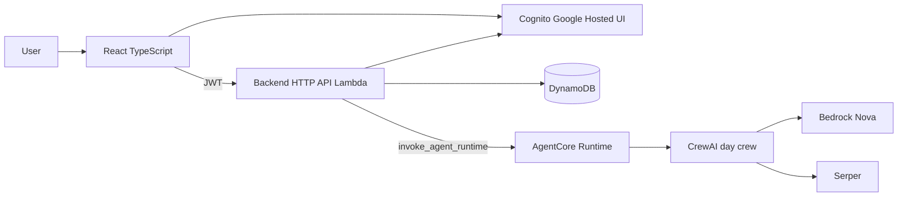
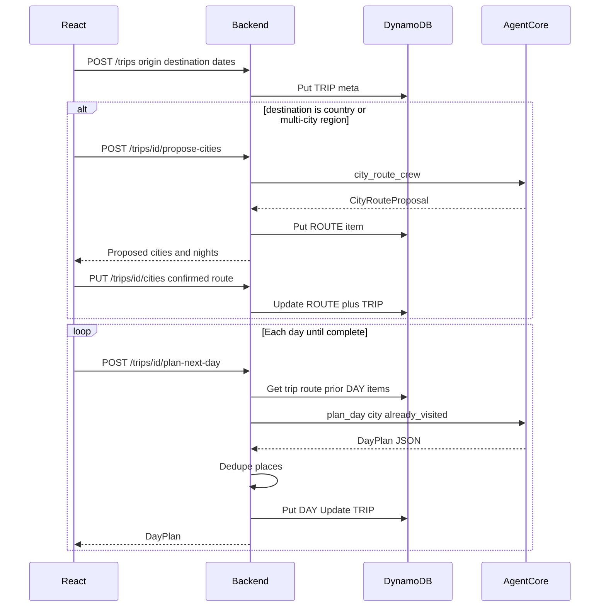

# Vacation Planner

Multi-agent travel planner built with **CrewAI**, **Amazon Bedrock (Nova)**, and **Serper**. Dated trip mode: origin → destination, start/end dates (up to **14 days**), city routing for countries, then **one day at a time**, persisted in a **DynamoDB single-table**.

<!-- Live demo: TBD -->

## Features

- Plan a trip from origin to destination with start and end dates (up to 14 days)
- Pick a city or a country; for a country, review and adjust which cities to visit before day-by-day planning
- Generate one day’s itinerary at a time, with places, timing, and overnight city
- See practical place details (maps link, category, visit reason, bathroom availability when known)
- Avoid repeating the same places across days
- Sign in with Google and save trips to revisit later
- Browse a full trip timeline after days are planned

## Repository layout

Three deployable codebases at the top level — no shared `apps/` umbrella:

```text
.
├── frontend/                   # React TypeScript SPA (Vite)
├── backend/                    # HTTP API: Cognito JWT, DynamoDB, invoke AgentCore
├── agent/                      # CrewAI crews + AgentCore Runtime package
│   ├── crews/day_plan/         # Working local crew (Phoenix)
│   ├── crews/city_route/       # Placeholder
│   ├── models/
│   └── main.py
├── docs/DATA_MODEL.md          # Place, CityRoute, DayPlan, Trip + DynamoDB
└── infra/                      # Terraform: Cognito, API, DynamoDB, AgentCore, CloudFront
```

| Package | Role |
| --- | --- |
| [`frontend`](./frontend) | UI + Cognito login → talks only to backend |
| [`backend`](./backend) | Auth, persistence, orchestration |
| [`agent`](./agent) | Crews + AgentCore runtime (no DynamoDB / Cognito) |
| [`infra`](./infra) | Terraform modules for AWS |

## Architecture (target)



**Backend:** verifies Cognito JWT, reads/writes DynamoDB, calls AgentCore with server-side IAM. The browser never holds AWS credentials or talks to AgentCore directly.

### Planning sequence (city route, then days)



**City detection (MVP):** user selects `destination_type` (`city` \| `country` \| `region`). City destinations skip propose-cities.

## Data model

See [docs/DATA_MODEL.md](./docs/DATA_MODEL.md).

## Local development (crew)

Working piece today: **day plan crew** under `agent/crews/day_plan`.

### Prerequisites

- Python 3.10–3.13, `uv`
- AWS credentials with Bedrock access (Nova)
- `SERPER_API_KEY` in `agent/crews/day_plan/.env` (see `.env.example`)

### Run without TUI streaming (Bedrock tools)

```bash
cd agent/crews/day_plan
uv sync
CREWAI_DMN=1 uv run crewai run --inputs '{"topic":"Tokyo"}'
```

Or with Phoenix:

```bash
# Terminal 1
cd agent/crews/day_plan
uv run python -m phoenix.server.main serve
# http://localhost:6006

# Terminal 2
cd agent/crews/day_plan
uv run python run_with_phoenix.py --topic "Tokyo"
```

In Phoenix, select project **`vacation_planner`** → **Traces**.

> **Note:** `custom:<name>` tool refs execute `tools/<name>.py` when the crew loads. Only run projects you trust.

## Infrastructure (Terraform)

AWS is defined under [`infra/`](./infra) (DynamoDB, Cognito, HTTP API + Lambda, S3/CloudFront, optional AgentCore).

```bash
cd infra
cp terraform.tfvars.example terraform.tfvars
terraform init
terraform plan
terraform apply
```

See [`infra/README.md`](./infra/README.md) for Google IdP vars, frontend sync, and enabling AgentCore.

## Cost notes

- Prefer Nova Lite/Pro; keep crew `memory: false` (no OpenAI embedder).
- Day-by-day planning caps token use vs one giant 14-day prompt.
- DynamoDB on-demand + AgentCore active-consumption: ~$0 idle.
- Phoenix is local-only; do not ship it into AgentCore.
