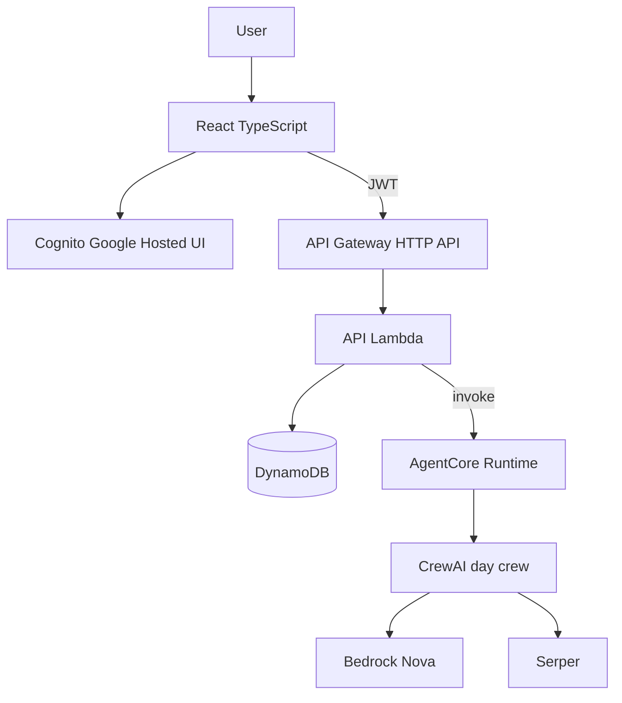
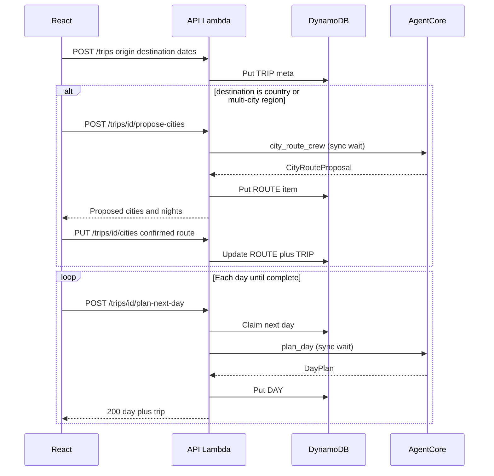

# Vacation Planner

Multi-agent travel planner built with **CrewAI**, **Amazon Bedrock (Nova)**, and **Serper**. Dated trip mode: origin → destination, start/end dates (up to **14 days**), city routing for countries, then **one day at a time**, persisted in a **DynamoDB single-table**.

<!-- Live demo: TBD -->

## Features

- Plan a trip from origin to destination with start and end dates (up to 14 days)
- Pick a city or a country; for a country, review and adjust which cities to visit before day-by-day planning
- Generate one day’s itinerary at a time, with places, timing, and overnight city
- See practical place details (maps link, category, visit reason, bathroom availability when known)
- Avoid repeating the same places across days
- Sign in with Google and save trips to revisit later
- Browse a full trip timeline after days are planned

## Repository layout

Three deployable codebases at the top level — no shared `apps/` umbrella:

```text
.
├── frontend/                   # React TypeScript SPA (Vite)
├── backend/                    # HTTP API: Cognito JWT, DynamoDB, invoke AgentCore
├── agent/                      # CrewAI crews + AgentCore Runtime package
│   ├── crews/day_plan/         # One-day crew → DayPlan (structured)
│   ├── crews/city_route/       # Country/region → CityRoute (structured)
│   ├── models/
│   └── main.py
├── docs/
│   ├── DATA_MODEL.md
│   └── architecture-decisions/ # ADRs (async planning, Lambda shape, …)
└── infra/                      # Terraform: Cognito, API, DynamoDB, AgentCore, CloudFront
```

| Package | Role |
| --- | --- |
| [`frontend`](./frontend) | UI + Cognito login → talks only to backend |
| [`backend`](./backend) | Auth, persistence, orchestration |
| [`agent`](./agent) | Crews + AgentCore runtime (no DynamoDB / Cognito) |
| [`infra`](./infra) | Terraform modules for AWS |
| [`docs/architecture-decisions`](./docs/architecture-decisions) | Architecture decision records |

## Architecture



**Backend:** verifies Cognito JWT (via API Gateway authorizer), reads/writes DynamoDB, invokes AgentCore with server-side IAM. The browser never holds AWS credentials or talks to AgentCore directly.

**MVP planning:** `POST /trips/{id}/plan-next-day` is **synchronous** (claim day → wait for crew → **200** with the day). Fine for `CREW_MODE=fake` and short runs.

**Target:** async claim + **202** + client polling when AgentCore exceeds API Gateway’s ~30s sync limit ([ADR 001](./docs/architecture-decisions/001-async-plan-next-day-polling.md)). MVP uses **Runtime only** (no Memory/Gateway/Browser). See [docs/architecture-decisions](./docs/architecture-decisions/).

### Planning sequence (city route, then days) — MVP



**City detection (MVP):** user selects `destination_type` (`city` \| `country` \| `region`). City destinations skip propose-cities.

## Data model

See [docs/DATA_MODEL.md](./docs/DATA_MODEL.md).

## Local development (crew)

Working piece today: **day plan** and **city route** crews under `agent/crews/`.

### Prerequisites

- Python 3.10–3.13, `uv`
- AWS credentials with Bedrock access (Nova)
- `SERPER_API_KEY` in `agent/.env` (see `agent/.env.example`)

### Run without TUI streaming (Bedrock tools)

```bash
cd agent/crews/day_plan
uv sync
CREWAI_DMN=1 uv run crewai run
```

Or with Phoenix / smoke test:

```bash
# Terminal 1
cd agent/crews/day_plan
uv run python -m phoenix.server.main serve
# http://localhost:6006

# Terminal 2
cd agent/crews/day_plan
uv run python smoke_test.py --overnight-city Tokyo --day-index 1 --date 2026-09-01
# or: uv run python run_with_phoenix.py --overnight-city Tokyo --day-index 1 --date 2026-09-01
```

In Phoenix, select project **`vacation_planner`** → **Traces**.

> **Note:** `custom:<name>` tool refs execute `tools/<name>.py` when the crew loads. Only run projects you trust.

## Local development (backend / DynamoDB)

Two layers for the single-table store:

| Mode | Tool | When |
| --- | --- | --- |
| Automated tests | **moto** (pytest) | Fast, in-process, no Docker |
| Manual local use | **DynamoDB Local** (Docker) | Real DynamoDB-compatible endpoint |

```bash
# Access-pattern tests (moto)
cd backend
uv sync --group dev
uv run pytest

# DynamoDB Local (Docker Desktop must be running)
cd backend
docker compose up -d
uv run python scripts/create_local_table.py
```

Defaults: `http://localhost:8000`, table `vacation-planner-local-table`. Data persists in the Docker named volume `dynamodb_data` (not under this repo); `docker compose down -v` deletes it.

See [`backend/README.md`](./backend/README.md) for env vars, trip API routes, Lambda packaging, and `smoke_trip_flow.py`.

Local backend work always needs:

```bash
export AUTH_MODE=dev CREW_MODE=fake
```

(`AUTH_MODE` defaults to `cognito` for deploy; code default `CREW_MODE=fake` is for local/backend-only work. Deployed Lambda uses `CREW_MODE=agentcore`.)

## Local development (frontend)

Demo UI (no API required):

```bash
cd frontend
npm install
npm run dev
# http://localhost:5173
```

Demo mode is on by default. Live create against a local backend:

```bash
# Terminal A — API on :8787
cd backend
export AUTH_MODE=dev CREW_MODE=fake SAFETY_MODE=off
uv run python scripts/local_api.py

# Terminal B
cd frontend
VITE_USE_DEMO_DATA=false npm run dev
```

Vite proxies `/api` → `http://127.0.0.1:8787`. For a remote API set `VITE_API_URL`. Details: [`frontend/README.md`](./frontend/README.md).

```bash
cd frontend && npm test
```

### Git pre-push (offline backend tests)

A `pre-push` hook runs `backend` pytest (moto only — no Bedrock, no DynamoDB Local). Install once after clone:

```bash
./scripts/install-git-hooks.sh
```

### CI

GitHub Actions (`.github/workflows/ci.yml`) on push/PR to `main`:

- Backend: `uv sync` + pytest
- Frontend: `npm ci` + vitest + production build
- Agent: lightweight eval harness smoke (`evals/test_harness.py`, no CrewAI install)

## Infrastructure (Terraform)

AWS is defined under [`infra/`](./infra) (DynamoDB, Cognito, HTTP API + Lambda, S3/CloudFront, AgentCore runtime, Bedrock Guardrails).

AgentCore is **required for AWS deploy** (API Lambda always uses `CREW_MODE=agentcore`). Set the ECR image URI and Bedrock model ARNs before apply.

```bash
# Required: package backend src + production deps (not raw backend/src)
cd backend && ./scripts/build_lambda.sh

cd ../infra
cp terraform.tfvars.example terraform.tfvars
# Prefer env vars for account-specific / secret values:
#   export TF_VAR_agent_runtime_container_uri=...
#   export TF_VAR_agent_allowed_bedrock_model_arns='["arn:..."]'
#   export TF_VAR_serper_api_key=...
terraform init
terraform plan
terraform apply
```

See [`infra/README.md`](./infra/README.md) for Google IdP vars, frontend sync, and AgentCore/Guardrails details.

## Cost notes

- Prefer Nova Lite/Pro; keep crew `memory: false` (no OpenAI embedder).
- Day-by-day planning caps token use vs one giant 14-day prompt.
- DynamoDB on-demand + AgentCore active-consumption: ~$0 idle.
- Phoenix is local-only; do not ship it into AgentCore.
