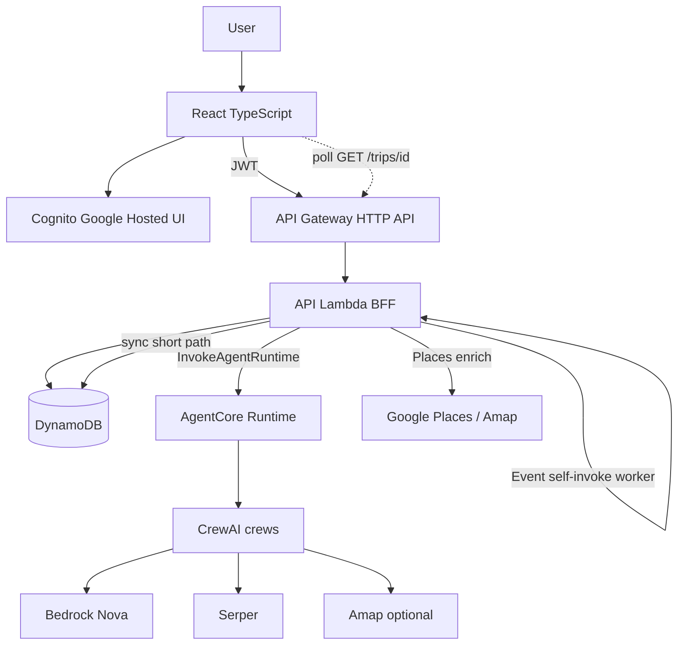
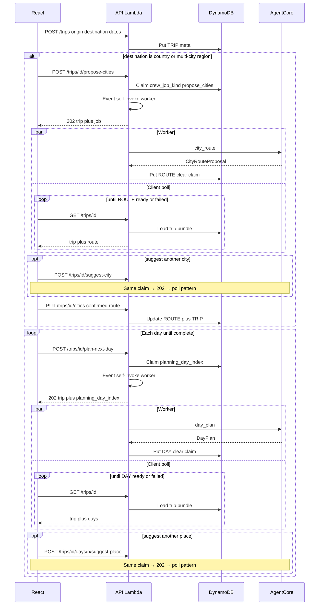

# AI Vacation Planner

Plan real multi-day trips with multi-agent AI — city routing, day-by-day itineraries, and production guardrails — without a blank-page LLM chat.

**[Live Demo](https://d3t3uxn4yyxw2h.cloudfront.net)** · Demo Video (coming soon) · [Architecture](#architecture) · [Evaluation](./agent/evals/README.md)

<!-- Add a product screenshot or short GIF under docs/ when available:

-->

## Engineering highlights

- **Multi-agent planning with deterministic post-generation validation** — CrewAI + Bedrock Nova propose days; the BFF enforces meals, balance, and closed places; overpacked days are trimmed at ≥150% of comfort and soft-warned before persist
- **Idempotent asynchronous AgentCore orchestration** — claim → 202 → Event worker → poll for plan-next-day and LLM crew jobs (`propose-cities`, `suggest-city`, `suggest-place`); recovers stuck work without double-writes ([ADR 001](./docs/architecture-decisions/001-async-plan-next-day-polling.md))
- **Offline and online AI evaluation** — fixture scorers, preference judge, and product/quality metrics in DynamoDB
- **Secure AWS serverless stack (Terraform)** — Cognito Hosted UI, HTTP API + Lambda, DynamoDB single-table, AgentCore, Bedrock Guardrails, S3/CloudFront
- **Cost-aware day-by-day generation** — plan one day at a time (max 14), Nova models, ~$0 idle

### What I designed end-to-end

Product flow (create → cities → days), data model and DynamoDB keys, async planning contract, Places enrich + photo cache, quality/retry policy, Terraform modules, and the React wizard SPA.

### Production problems solved

- Long crew runs that would time out API Gateway (~30s) → async claim + Event worker + client poll for **plan-next-day**, **propose-cities**, **suggest-city**, and **suggest-place**
- LLM days that skip meals or stack food-only stops → balance checks + plan-day retry
- Days that blow past traveler energy → soft caution above comfort; generated days at ≥150% are truncated when optional stops can be cut
- Expiring Google photo CDNs / missing landmark photos → owned-trip photo proxy, durable Wikimedia cache, Wikipedia fallback
- Secrets in Terraform state → Secrets Manager ARNs + sync scripts

### Measurable results

| Signal | Where / what |
| --- | --- |
| CI | Backend pytest (moto), frontend Vitest + production build, agent eval harness smoke |
| Offline evals | Fixture scorers + preference judge; metrics in DynamoDB (`agent/evals`) |
| Orchestration A/B | Full 31-case compare: multi-agent `day_plan` **~90%** hard-constraint pass vs single-call **~52%** (+39 pp); multi ~1.4–1.8× latency, ~1.1–1.5× cost — still under decision budgets ([rule](./docs/PLANNING_QUALITY.md#orchestration-experiment-three-agent-vs-single-call), [report](./agent/reports/orchestration_compare.md)) |
| Online quality | `QUALITY_METRIC` / `RETRY_METRIC` / `PRODUCT_METRIC` → CloudWatch + metrics table; private `/metrics` SPA |
| Ops | CloudWatch API logs dashboard + optional AgentCore / GenAI observability |

---

## Features

- Plan a trip from origin to destination with start and end dates (up to 14 days)
- Pick a city or a country; for a country, **async** propose-cities then confirm / edit the route
- Suggest an extra overnight city (candidates) or an extra place on a day — same async claim → poll path
- Generate one day’s itinerary at a time, with places, timing, and overnight city
- See practical place details (maps, hours, cost, why suggested, watch-outs)
- Avoid repeating the same places across days
- Sign in with Google (and other Cognito IdPs) and save trips to revisit later
- Browse a full trip timeline after days are planned

## Repository layout

Three deployable codebases at the top level — no shared `apps/` umbrella:

```text
.
├── frontend/                   # React TypeScript SPA (Vite)
├── backend/                    # HTTP API: Cognito JWT, DynamoDB, invoke AgentCore
├── agent/                      # CrewAI crews + AgentCore Runtime package
│   ├── crews/day_plan/         # Researcher→planner→reviewer → DayPlanWithQuality
│   ├── crews/day_plan_single/  # Single-call day baseline (orchestration A/B)
│   ├── crews/city_route/       # Country/region → CityRoute (structured)
│   ├── crews/suggest_city/     # Additive overnight-city candidates
│   ├── crews/suggest_place/    # Extra stop → Place
│   ├── evals/                  # Offline fixtures + --compare-orchestration
│   ├── models/
│   └── main.py
├── docs/
│   ├── DATA_MODEL.md
│   ├── ENVIRONMENT.md          # Local + Terraform env / TF_VAR reference
│   ├── PLANNING_QUALITY.md     # Energy↔hours, safety/guardrail/evals index
│   └── architecture-decisions/ # ADRs (async planning, Lambda shape, …)
└── infra/                      # Terraform: Cognito, API, DynamoDB, AgentCore, CloudFront
```

| Package | Role |
| --- | --- |
| [`frontend`](./frontend) | UI + Cognito login → talks only to backend |
| [`backend`](./backend) | Auth, persistence, orchestration |
| [`agent`](./agent) | Crews + AgentCore runtime (no DynamoDB / Cognito) |
| [`infra`](./infra) | Terraform modules for AWS |
| [`docs/architecture-decisions`](./docs/architecture-decisions) | Architecture decision records |
| [`docs/ENVIRONMENT.md`](./docs/ENVIRONMENT.md) | Local + Terraform env vars / `TF_VAR_*` |
| [`docs/PLANNING_QUALITY.md`](./docs/PLANNING_QUALITY.md) | Energy load caps; pointers to safety, Guardrails, evals |

## Architecture


```mermaid
flowchart TB
  user[User] --> spa[React TypeScript]
  spa --> cognito[Cognito Google Hosted UI]
  spa -->|"JWT"| apigw[API Gateway HTTP API]
  apigw --> api[API Lambda BFF]
  api --> ddb[(DynamoDB)]
  spa -.->|"poll GET /trips/id"| apigw
  api -->|"sync short path"| ddb
  api -->|"Event self-invoke worker"| api
  api -->|"InvokeAgentRuntime"| runtime[AgentCore Runtime]
  runtime --> crews[CrewAI crews]
  crews --> bedrock[Bedrock Nova]
  crews --> serper[Serper]
  crews --> amap[Amap optional]
  api -->|"Places enrich"| googlePlaces[Google Places / Amap]
```

**Backend:** verifies Cognito JWT (via API Gateway authorizer), reads/writes DynamoDB, invokes AgentCore with server-side IAM. The browser never holds AWS credentials or talks to AgentCore directly.

### Crews

| Crew | Package | Used by | Output |
| --- | --- | --- | --- |
| `day_plan` | `agent/crews/day_plan` | `POST …/plan-next-day` | `DayPlanWithQuality` (researcher → planner → reviewer) |
| `day_plan_single` | `agent/crews/day_plan_single` | Offline orchestration A/B only | Same schema, one agent |
| `city_route` | `agent/crews/city_route` | `POST …/propose-cities` | Proposed city route + nights |
| `suggest_city` | `agent/crews/suggest_city` | `POST …/suggest-city` | Overnight-city candidates (not persisted until user adds + confirms) |
| `suggest_place` | `agent/crews/suggest_place` | `POST …/days/{n}/suggest-place` | One extra `Place` on a day |

### Async LLM workflow

API Gateway HTTP API caps sync integrations at ~**30s**. Any GenAI route that can exceed that uses **claim → 202 → Event worker → client poll** (same Lambda package; worker payload). Details and alternatives: [ADR 001](./docs/architecture-decisions/001-async-plan-next-day-polling.md).

| Route | Async when | Claim fields | Client |
| --- | --- | --- | --- |
| `POST /trips/{id}/plan-next-day` | `CREW_MODE=agentcore` (or `PLAN_NEXT_DAY_ASYNC=on`) | `planning_day_index` / `planning_started_at` | Poll until DAY appears or `planning_error` |
| `POST /trips/{id}/propose-cities` | `CREW_LLM_ASYNC` default **on** | `crew_job_kind=propose_cities` | Poll until ROUTE proposed or `crew_job_error` |
| `POST /trips/{id}/suggest-city` | same | `crew_job_kind=suggest_city` | Poll until `suggest_city_candidates` (or error) |
| `POST /trips/{id}/days/{n}/suggest-place` | same | `crew_job_kind=suggest_place` (+ day index) | Poll until place appended (or error) |

Only one of day-planning claim **or** a crew-job claim may be held at a time. Stale claims are reclaimable. Opt out of propose/suggest async with `CREW_LLM_ASYNC=off` (unit tests do this). Fake/local `plan-next-day` stays sync **200** unless forced async.

API contract: [`backend/openapi.yaml`](./backend/openapi.yaml).

### Planning sequence (cities, then days)


```mermaid
sequenceDiagram
  participant UI as React
  participant API as API Lambda
  participant DDB as DynamoDB
  participant AC as AgentCore

  UI->>API: POST /trips origin destination dates
  API->>DDB: Put TRIP meta
  alt destination is country or multi-city region
    UI->>API: POST /trips/id/propose-cities
    API->>DDB: Claim crew_job_kind propose_cities
    API->>API: Event self-invoke worker
    API-->>UI: 202 trip plus job
    par Worker
      API->>AC: city_route
      AC-->>API: CityRouteProposal
      API->>DDB: Put ROUTE clear claim
    and Client poll
      loop until ROUTE ready or failed
        UI->>API: GET /trips/id
        API->>DDB: Load trip bundle
        API-->>UI: trip plus route
      end
    end
    opt suggest another city
      UI->>API: POST /trips/id/suggest-city
      Note over UI,AC: Same claim → 202 → poll pattern
    end
    UI->>API: PUT /trips/id/cities confirmed route
    API->>DDB: Update ROUTE plus TRIP
  end
  loop Each day until complete
    UI->>API: POST /trips/id/plan-next-day
    API->>DDB: Claim planning_day_index
    API->>API: Event self-invoke worker
    API-->>UI: 202 trip plus planning_day_index
    par Worker
      API->>AC: day_plan
      AC-->>API: DayPlan
      API->>DDB: Put DAY clear claim
    and Client poll
      loop until DAY ready or failed
        UI->>API: GET /trips/id
        API->>DDB: Load trip bundle
        API-->>UI: trip plus days
      end
    end
    opt suggest another place
      UI->>API: POST /trips/id/days/n/suggest-place
      Note over UI,AC: Same claim → 202 → poll pattern
    end
  end
```

**City detection (MVP):** user selects `destination_type` (`city` \| `country` \| `region`). City destinations skip propose-cities and get a **synthetic confirmed** `ROUTE` on create so day planning always has an overnight city.

### Current limitations

- **Polling, not push** — clients poll `GET /trips/{id}` (backoff); no WebSocket / AppSync yet
- **Event self-invoke, not SQS** — no DLQ; mitigated with stale-claim reclaim + error fields on the TRIP
- **AgentCore Runtime only** — no AgentCore Memory / Gateway / Browser
- **Orchestration product lock** — full-suite A/B favors three-agent day_plan, but a repeated locked decision run is still open ([PLANNING_QUALITY](./docs/PLANNING_QUALITY.md#orchestration-experiment-three-agent-vs-single-call))
- **Paid plans** — trip / GenAI caps exist; monetization tiers deferred ([ADR 006](./docs/architecture-decisions/006-admin-limits-genai-caps.md))

Scale-up path (SQS worker, push notifications, Step Functions): [architecture-decisions README](./docs/architecture-decisions/).

## Data model

See [docs/DATA_MODEL.md](./docs/DATA_MODEL.md).

## Local development (crew)

Active crews (see [Crews](#crews) above):

| Package | Smoke / notes |
| --- | --- |
| `agent/crews/day_plan` | Primary day itinerary; Phoenix + `smoke_test.py` below |
| `agent/crews/day_plan_single` | Orchestration A/B baseline |
| `agent/crews/city_route` | Country/region propose-cities |
| `agent/crews/suggest_city` | Additive overnight-city candidates |
| `agent/crews/suggest_place` | Extra stop on a planned day |

### Prerequisites

- Python 3.10–3.13, `uv`
- AWS credentials with Bedrock access (Nova)
- `SERPER_API_KEY` in `agent/.env` (see `agent/.env.example`)

### Run without TUI streaming (Bedrock tools)

```bash
cd agent/crews/day_plan
uv sync
CREWAI_DMN=1 uv run crewai run
```

Or with Phoenix / smoke test:

```bash
# Terminal 1
cd agent/crews/day_plan
uv run python -m phoenix.server.main serve
# http://localhost:6006

# Terminal 2
cd agent/crews/day_plan
uv run python smoke_test.py --overnight-city Tokyo --day-index 1 --date 2026-09-01
# or: uv run python run_with_phoenix.py --overnight-city Tokyo --day-index 1 --date 2026-09-01
```

In Phoenix, select project **`vacation_planner`** → **Traces**.

> **Note:** `custom:<name>` tool refs execute `tools/<name>.py` when the crew loads. Only run projects you trust.

## Local development (one command)

Live UI + API + DynamoDB Local (Docker Desktop must be running):

```bash
# from repo root
./scripts/dev.sh
```

Opens **http://127.0.0.1:5173** (`VITE_USE_DEMO_DATA=false`, `AUTH_MODE=dev`, `CREW_MODE=fake`). Ctrl+C stops the API and Vite; DynamoDB stays up until you `docker compose -f backend/docker-compose.yml down`.

## Local development (backend / DynamoDB)

Two layers for the single-table store:

| Mode | Tool | When |
| --- | --- | --- |
| Automated tests | **moto** (pytest) | Fast, in-process, no Docker |
| Manual local use | **DynamoDB Local** (Docker) | Real DynamoDB-compatible endpoint |

```bash
# Access-pattern tests (moto)
cd backend
uv sync --group dev
uv run pytest

# DynamoDB Local (Docker Desktop must be running)
cd backend
docker compose up -d
uv run python scripts/create_local_table.py
```

Defaults: `http://localhost:8000`, table `vacation-planner-local-table`. Open the local DynamoDB GUI at **http://localhost:8001**. The compose stack runs DynamoDB Local in memory, so data resets when the container stops.

See [`backend/README.md`](./backend/README.md) for env vars, trip API routes, Lambda packaging, and `smoke_trip_flow.py`.

Local backend work always needs:

```bash
export AUTH_MODE=dev CREW_MODE=fake
```

(`AUTH_MODE` defaults to `cognito` for deploy; code default `CREW_MODE=fake` is for local/backend-only work. Deployed Lambda uses `CREW_MODE=agentcore`.)

## Local development (frontend)

Demo UI (no API required):

```bash
cd frontend
npm install
npm run dev
# http://localhost:5173
```

Demo mode is on by default. Live create against a local backend:

```bash
# Terminal A — API on :8787
cd backend
export AUTH_MODE=dev CREW_MODE=fake SAFETY_MODE=off
uv run python scripts/local_api.py

# Terminal B
cd frontend
VITE_USE_DEMO_DATA=false npm run dev
```

Vite proxies `/api` → `http://127.0.0.1:8787`. For a remote API set `VITE_API_URL`. Details: [`frontend/README.md`](./frontend/README.md).

```bash
cd frontend && npm test
```

### Git pre-push (offline backend tests)

A `pre-push` hook runs `backend` pytest (moto only — no Bedrock, no DynamoDB Local). Install once after clone:

```bash
./scripts/install-git-hooks.sh
```

### CI

GitHub Actions (`.github/workflows/ci.yml`) on push/PR to `main`:

- Backend: `uv sync` + pytest
- Frontend: `npm ci` + vitest + production build
- Agent: lightweight eval harness smoke (`evals/test_harness.py`, no CrewAI install)

## Infrastructure (Terraform)

AWS is defined under [`infra/`](./infra) (DynamoDB, Cognito, HTTP API + Lambda, S3/CloudFront, AgentCore runtime, Bedrock Guardrails).

AgentCore is **required for AWS deploy** (API Lambda always uses `CREW_MODE=agentcore`). Set the ECR image URI and Bedrock model ARNs before apply.

```bash
# Required: package backend src + production deps (not raw backend/src)
cd backend && ./scripts/build_lambda.sh

cd ../infra
cp terraform.tfvars.example terraform.tfvars
# Prefer env vars for account-specific / secret values:
#   export TF_VAR_agent_runtime_container_uri=...
#   export TF_VAR_agent_allowed_bedrock_model_arns='["arn:..."]'
#   export TF_VAR_serper_api_key=...
terraform init
terraform plan
terraform apply
```

See [`infra/README.md`](./infra/README.md) for Google IdP vars, frontend sync, and AgentCore/Guardrails details.

## Cost notes

- Prefer Nova Lite/Pro; keep crew `memory: false` (no OpenAI embedder).
- Day-by-day planning caps token use vs one giant 14-day prompt.
- DynamoDB on-demand + AgentCore active-consumption: ~$0 idle.
- Phoenix is local-only; do not ship it into AgentCore.
- Deployed AgentCore uses ADOT only when `enable_genai_observability=true` (image entrypoint + runtime env); Terraform also enables Transaction Search (`infra/observability/`) — see [`agent/README.md`](./agent/README.md) and [`infra/README.md`](./infra/README.md).
