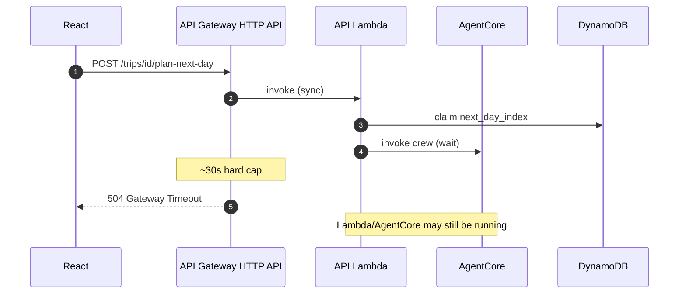
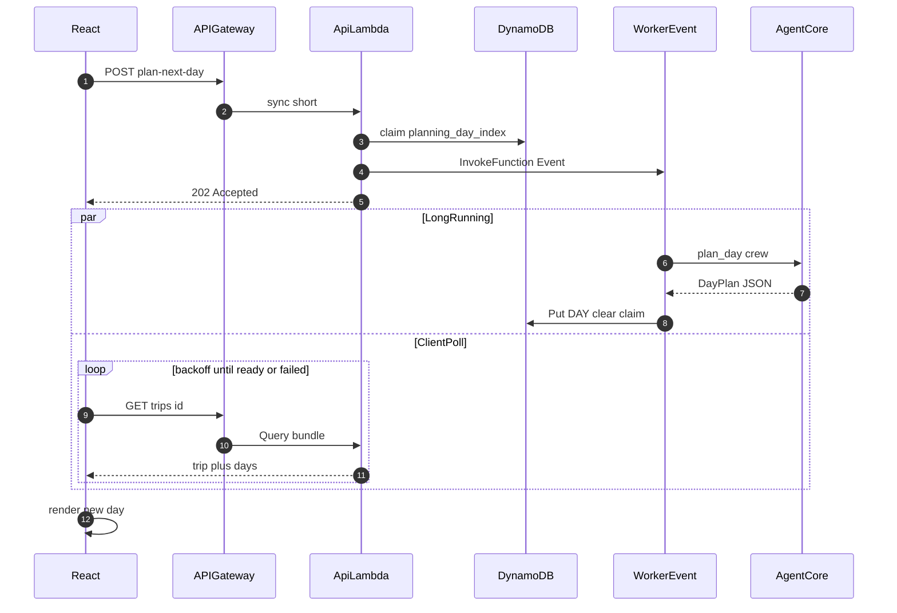
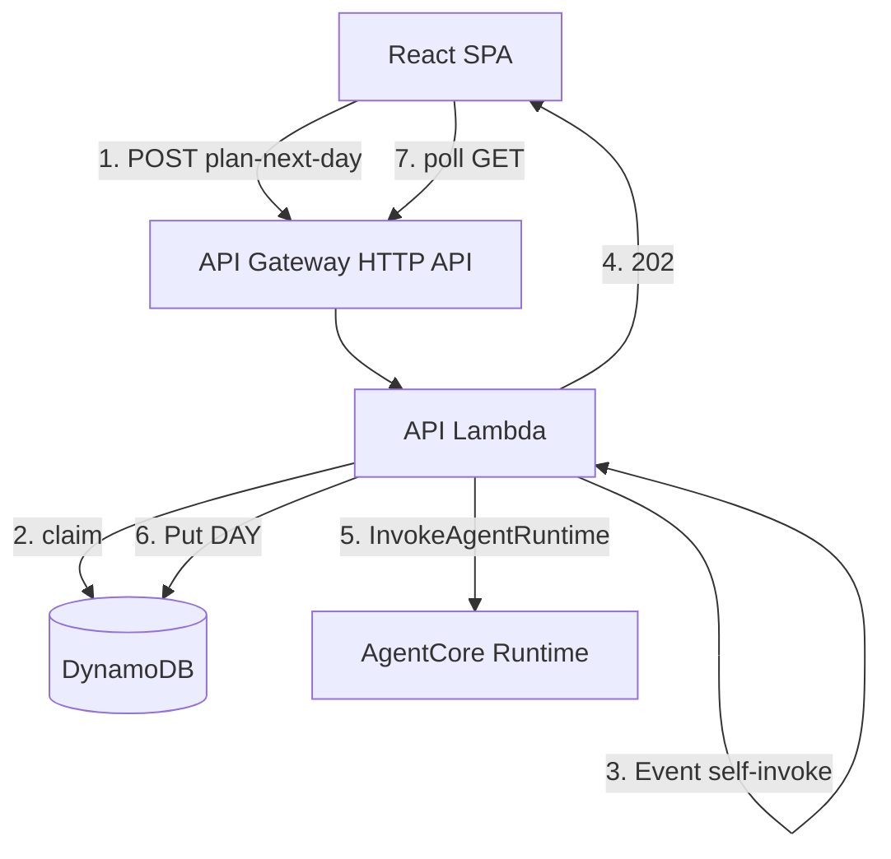
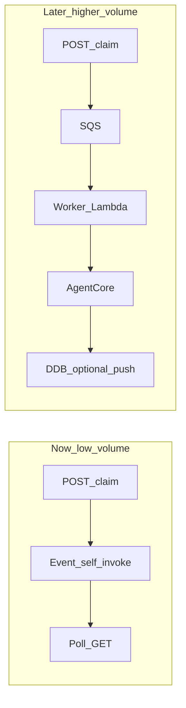

# ADR 001: Async plan-next-day with client polling

- **Status:** Accepted. **Deployed AgentCore path:** async claim + **202** + client poll. **Local `CREW_MODE=fake` / `local`:** sync **200** for fast tests.
- **Date:** 2026-07-21 (async implemented 2026-07-22)
- **Deciders:** Project maintainers

## Context

Day planning invokes CrewAI via AgentCore (Bedrock). That work often exceeds **~30 seconds**.

Production traffic path is:

`Browser → API Gateway HTTP API → API Lambda → DynamoDB / AgentCore`

**API Gateway HTTP API** has a fixed sync integration timeout of about **30 seconds** (not increasable). Raising the Lambda timeout (API function is **300s** for the Event worker) does **not** help the gateway: the gateway returns **504** while Lambda may still be running if you wait on the sync path.

Holding an open HTTP request for multi-minute LLM work is also a poor cost/UX fit (gateway/Lambda duration, flaky mobile clients).

### Problem (sync wait)

## Decision

Use an **async job + client polling** pattern for long LLM work on **`CREW_MODE=agentcore`**:

1. **Accept quickly** — API Lambda authenticates, validates, **claims** the day via `planning_day_index` (without advancing `next_day_index` yet), and returns **202** `{ trip, planning_day_index }`.
2. **Run long work off the request path** — same Lambda package, **`InvocationType=Event` self-invoke** (worker payload). Worker calls AgentCore, enriches/filters, Puts DAY, then clears the claim and advances `next_day_index`.
3. **Client polls** — Frontend polls `GET /trips/{id}` with backoff until the DAY appears, `planning_error` / `failed`, or timeout.

**`CREW_MODE=fake` / `local`:** keep sync **200** `{ day, trip }` for fast tests and local DX.

Shorter routes (`create trip`, `GET`, confirm cities, suggest-place) stay **synchronous** for now.

In-progress lock lives on the **TRIP item** (`planning_day_index`, `planning_started_at`, `planning_error`), not in a queue. Stale claims (~6 min) can be reclaimed.

### MVP vs deploy

| Layer | `CREW_MODE=fake` / `local` | `CREW_MODE=agentcore` (deploy) |
| --- | --- | --- |
| `POST /trips/{id}/plan-next-day` | Sync wait → **200** `{ day, trip }` | Claim + Event worker → **202** `{ trip, planning_day_index }` |
| Frontend | Use day from response | Poll `GET /trips/{id}` until day appears / failed |
| AgentCore | N/A | Invoked inside worker (not on API GW sync path) |

### Target sequence

### Component view

## Consequences

### Positive

- Respects HTTP API’s ~30s limit without switching API product or requesting REST timeout quotas.
- Keeps the HTTP request path **short** (auth + DynamoDB claim + enqueue).
- Scale-to-zero friendly: pay for AgentCore/Bedrock only while planning.
- Trip-level claim avoids duplicate in-flight days; BFF still owns enrich/quality/DynamoDB writes.

### Negative / tradeoffs

- Frontend must handle “Planning…” and polling.
- Event self-invoke has weaker delivery semantics than SQS (no DLQ); mitigated with stale-claim reclaim + `planning_error`.
- Same Lambda timeout/memory for API and worker (300s).
- Slightly more complex than a single sync handler.

## Alternatives considered (pros / cons)

### A. Sync wait on API Gateway (rejected for AgentCore)

| Pros | Cons |
| --- | --- |
| Simplest code path; day in the POST response | HTTP API ~**30s** hard cap → **504** on real crews |
| Easy local debugging | Ties UX to flaky long requests; pays gateway/Lambda for idle wait |

**Verdict:** OK only for `CREW_MODE=fake` / short local runs — which we keep.

### B. REST API + raised integration timeout (rejected)

| Pros | Cons |
| --- | --- |
| Might allow ~29s–minutes sync depending on quota | Still a bad fit for multi-minute AgentCore; quota/ops overhead |
| No polling UI | Does not fix mobile disconnects or cost of holding the connection |

**Verdict:** Wrong tool for multi-minute LLM jobs.

### C. Lambda `InvocationType=Event` self-invoke (**chosen**)

| Pros | Cons |
| --- | --- |
| Escapes API GW 30s with **one** deployable function | No queue buffer; rare Event drop → rely on stale reclaim |
| Same code package; simple IAM (`lambda:InvokeFunction` on self) | Shared timeout/memory with the API handler |
| Cheap at portfolio volume; easy to reason about | Weaker retries than SQS/DLQ (Event retries **only if the worker invoke fails** — handler must re-raise while the claim is held) |
| DynamoDB claim remains source of truth for in-flight work | Second concurrent execution billed while worker runs |

**Verdict:** Best complexity/reliability tradeoff for current volume. **Worker handler policy:** log failures, re-raise when `planning_day_index` is still held (so Lambda’s default async retries can finalize DAY→cursor), return quietly when the claim was already cleared as terminal failure.

### D. Dedicated worker Lambda (Event or direct), no SQS (deferred)

| Pros | Cons |
| --- | --- |
| Independent timeout/memory/IAM from the BFF | Two functions to build, deploy, and monitor |
| Clearer “API vs worker” separation in diagrams | Still no durable queue unless paired with SQS |
| API Lambda can stay short timeout | More Terraform and local-dev wiring |

**Verdict:** Nice cleanup later; not required to beat the gateway timeout.

### E. SQS + worker Lambda (deferred — “bigger scale”)

| Pros | Cons |
| --- | --- |
| Retries, visibility timeout, **DLQ**, burst buffering | Extra infra, IAM, alarms, poison-message handling |
| Decouples “accept job” from “run job” cleanly | Local/dev needs LocalStack or a sync fallback |
| Better ops story under failures | **AWS $** negligible at low volume; **engineering** cost is the real price (~0.5–1.5 days) |

**Verdict:** Add when stuck `planning_day_index` / failed workers become real ops pain — not for bill savings.

### F. AgentCore (or crew) writes DynamoDB directly (rejected)

| Pros | Cons |
| --- | --- |
| Fewer hops after crew finishes | Breaks BFF trust boundary ([ADR 003](./003-bff-agentcore-runtime-only.md)) |
| | Agent needs DynamoDB IAM + claim/enrich/quality logic duplicated |
| | Harder to keep Places enrich / safety on one path |

**Verdict:** Rejected; worker stays in the API package.

### G. Client notification: polling vs WebSocket / AppSync / SSE

| | **Polling `GET /trips/{id}` (chosen)** | **WebSocket / AppSync push** |
| --- | --- | --- |
| **Pros** | Reuses existing read API; backoff; stop when tab hidden; tiny cost at low volume | Instant “day ready”; fewer empty reads at high concurrency |
| **Cons** | Slight delay vs push; chatty if interval is too small | Connection-minutes, auth/reconnect, fan-out, extra API surface |

**Verdict:** Polling wins for discrete “Planning…” jobs at portfolio scale. Revisit push if many clients wait concurrently or we add live collaboration.

### H. Always-async vs AgentCore-only async

| | **Always 202 + poll** | **Async only when `CREW_MODE=agentcore` (chosen)** |
| --- | --- | --- |
| **Pros** | One client code path in prod and local | Unit tests / fake stay simple sync 200 |
| **Cons** | More FE/test churn for instantaneous fake crews | Two behaviors to document |

**Verdict:** AgentCore-only async; FE already accepts both 200 and 202.

## Improving for bigger scale

Keep claim + off-request-path AgentCore; change **delivery and notification** when metrics say so:

1. **Smarter polling** — already: backoff, tab-hidden pause; later ETag/`updated_at`.
2. **SQS + worker** — when retries/DLQ matter (see alternative E).
3. **Dedicated worker Lambda** — when API/worker resource profiles diverge (see D).
4. **Push** — when polling cost or UX becomes the bottleneck (see G).
5. **Step Functions** — only if multi-step orchestration needs visible state machines.
6. **Do not** hold API Gateway sync for LLM, or add provisioned concurrency, until measured.

## Follow-ups

- [x] Define trip/day status fields in [DATA_MODEL.md](../DATA_MODEL.md) (`drafting` → `planning` / `complete` / `failed`, plus `next_day_index`)
- [x] Claim-before-write for `next_day_index` on the sync MVP path
- [x] Implement claim → async invoke → worker write → poll in backend + frontend (AgentCore path; fake/local stay sync 200)
- [x] Keep AgentCore invoke out of the sync request path in production (Lambda Event worker)
- [x] Document pros/cons of sync vs Event self-invoke vs SQS vs push (this section)
- [x] Worker Event retries: re-raise while claim held; mark AgentCore transport/throttle as `ApiError.retryable` (do not `fail_planning` on those)
- [ ] **Async `propose-cities`** — still sync AgentCore on the API Gateway path in production; same ~30s timeout class of risk as pre-async plan-next-day. Acceptable for MVP if city-route crews stay short; otherwise claim + 202 + poll (or SQS) like plan-next-day.
