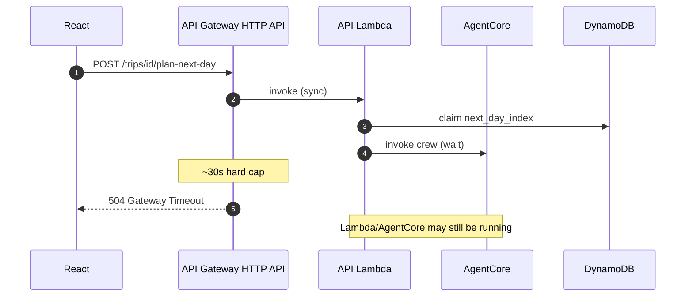
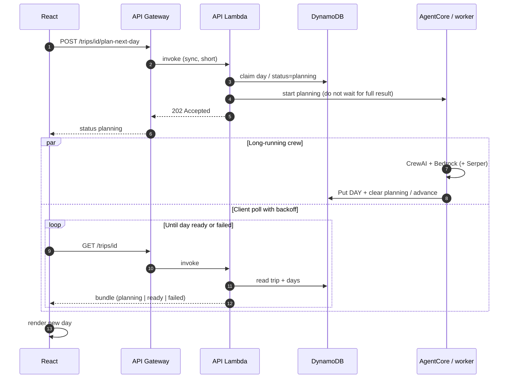
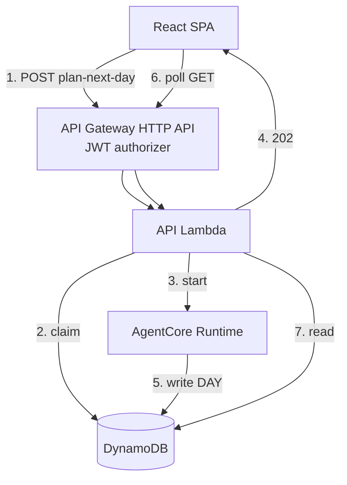
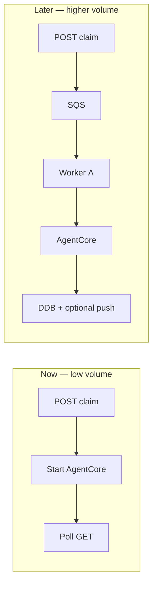

# ADR 001: Async plan-next-day with client polling

- **Status:** Accepted
- **Date:** 2026-07-21
- **Deciders:** Project maintainers

## Context

Day planning invokes CrewAI via AgentCore (Bedrock). That work often exceeds **~30 seconds**.

Production traffic path is:

`Browser → API Gateway HTTP API → API Lambda → DynamoDB / AgentCore`

**API Gateway HTTP API** has a fixed sync integration timeout of about **30 seconds** (not increasable). Raising the Lambda timeout (currently 60s, max 15 min) does **not** help: the gateway returns **504** while Lambda may still be running.

Holding an open HTTP request for multi-minute LLM work is also a poor cost/UX fit (gateway/Lambda duration, flaky mobile clients).

### Problem (sync wait)

## Decision

Use an **async job + polling** pattern for long LLM work (especially `POST /trips/{id}/plan-next-day`):

1. **Accept quickly** — API Lambda authenticates, validates, **claims** the next day slot (conditional update on `next_day_index` / equivalent), persists a “planning in progress” marker if needed, **starts** AgentCore (or async worker invoke), and returns **202** (or 200 with `status: planning`) without waiting for the full crew result.
2. **Run long work off the request path** — AgentCore Runtime (or a worker Lambda invoked asynchronously) executes the crew and writes the DAY item to DynamoDB when finished (reuse claim-first / conflict → 409 rules already intended for `plan-next-day`).
3. **Client polls** — Frontend polls `GET /trips/{id}` (or a thin status field on the trip) until the day appears or status becomes ready/failed.

Shorter routes (`create trip`, `GET`, confirm cities) stay **synchronous**.

Local `CREW_MODE=fake` may remain sync for speed while learning; production AgentCore path follows this ADR.

### Target sequence

### Component view

## Consequences

### Positive

- Respects HTTP API’s ~30s limit without switching API product or requesting REST timeout quotas.
- Keeps the API Lambda **thin** and cheap (auth + DynamoDB + invoke).
- Scale-to-zero friendly: pay for AgentCore/Bedrock only while planning.
- Aligns with claim-before-write to avoid duplicate day slots.

### Negative / tradeoffs

- Frontend must handle “Planning…” and polling.
- Need clear trip/day statuses (`planning`, `ready`, `failed`) and idempotent worker completion.
- Slightly more complex than a single sync handler.

### Why WebSocket push is out of scope (for now)

Pushing “day ready” over **WebSockets** (API Gateway WebSocket API, AppSync subscriptions, etc.) would improve UX slightly versus polling, but we defer it because:

| Factor | Why polling wins today |
| --- | --- |
| **Expected volume** | Portfolio / low concurrent users; a few polls per plan-next-day (backoff 1–2s for ~1–3 min) is negligible DynamoDB + Lambda cost |
| **Cost** | WebSocket APIs bill for connection-minutes and messages; idle or half-open tabs keep connections warm. Polling only runs while the user is waiting on one action |
| **Complexity** | Extra API, connection auth, reconnect/resume, fan-out when AgentCore finishes, local-dev parity. Polling reuses `GET /trips/{id}` we already need |
| **Product fit** | Planning is a discrete job, not a chat stream; users tolerate a short “Planning…” wait |

Revisit WebSockets (or SSE) when many clients wait on long jobs concurrently, or when we add multi-user live collaboration — see **Improving for bigger scale** below.

### Cost notes

- Prefer **polling with backoff** (e.g. 1–2s) over chatty intervals.
- Do not enable provisioned concurrency or always-on workers for this.
- Avoid Step Functions until orchestration complexity requires it.

## Alternatives considered

| Option | Why not (for now) |
| --- | --- |
| Sync wait through API Gateway | Hard ~30s cap on HTTP API; fragile for real crews |
| REST API + raised integration timeout | Possible for moderate GenAI sync; still bad for multi-minute; quota tradeoffs |
| WebSocket / AppSync push when day is ready | Cost + ops complexity vs low expected volume (see above) |
| Stream tokens to browser via API GW | Wrong channel; needs WebSockets/AppSync; not required for day-at-a-time MVP |
| One Lambda per route | Does not remove the gateway timeout |

## Improving for bigger scale

Keep claim + async AgentCore; change **notification and isolation** when metrics say so:

1. **Smarter polling first** — exponential backoff, stop on tab hidden, ETag/`updated_at` so empty polls are cheap.
2. **SQS between API and worker** — buffer bursts, retries/DLQ for failed days, avoid invoking AgentCore directly from the request Lambda.
3. **Dedicated worker Lambda** (optional) — higher timeout/memory than the BFF; API Lambda only claims + enqueues.
4. **Push when volume justifies it** — WebSocket or AppSync: worker writes DAY then publishes `trip_id` ready; clients subscribe instead of polling. Add only after polling cost or UX becomes the bottleneck.
5. **Step Functions** — multi-step pipelines (research → plan → critique) with visible state; skip while one crew kickoff is enough.
6. **Do not** hold API Gateway sync for LLM, or add provisioned concurrency “for scale,” until cold starts are a measured product issue.

## Follow-ups

- [ ] Define trip/day status fields in [DATA_MODEL.md](../DATA_MODEL.md) if missing
- [ ] Implement claim → async invoke → worker write → poll in backend + frontend
- [ ] Keep AgentCore invoke out of the sync request path in production
