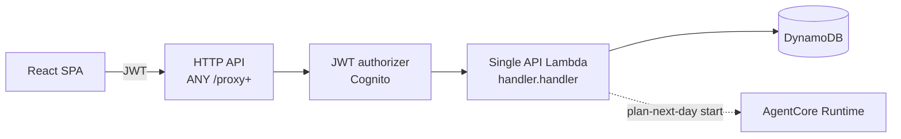
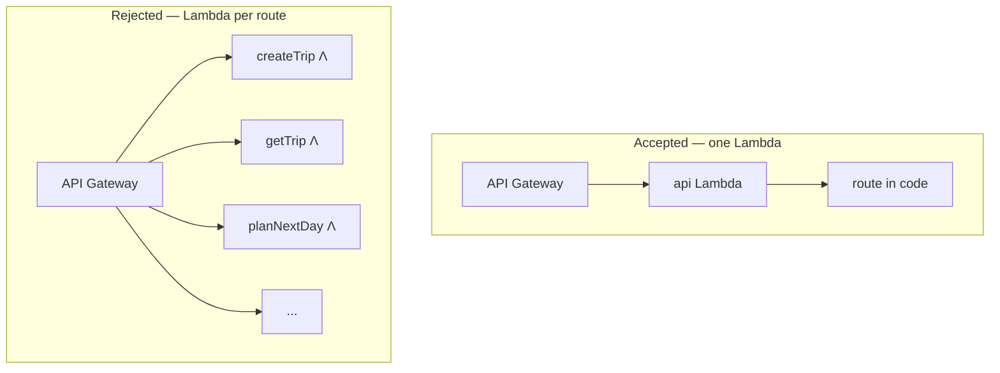
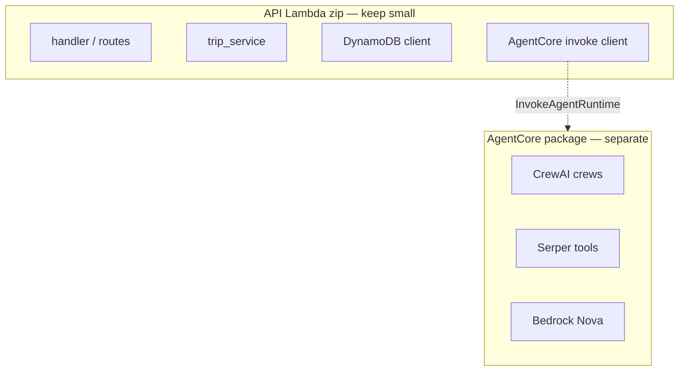

# ADR 002: Single API Lambda behind HTTP API

- **Status:** Accepted
- **Date:** 2026-07-21
- **Deciders:** Project maintainers

## Context

The BFF (Backend for Frontend) needs Cognito JWT auth, DynamoDB access, and orchestration of planning. We want minimal idle cost and simple ops.

## Decision

Use **one** API Lambda for all HTTP trip routes, fronted by **API Gateway HTTP API** with a Cognito JWT authorizer and `ANY /{proxy+}` → that Lambda.

Heavy LLM/crew work runs in **AgentCore Runtime**, not inside the API Lambda package (`CREW_MODE=agentcore` in deploy). See [001](./001-async-plan-next-day-polling.md) for how long runs avoid the gateway timeout.

### Deployed shape

### Why not one Lambda per route

Same account concurrency pool either way; more functions add Terraform and cold-start surface without removing the HTTP API ~30s limit.

### Package boundary (cost)

## Consequences

- Simple Terraform and one deployable zip (no CrewAI in the API package).
- Account Lambda concurrency is shared; one function vs many does not bypass the ~1000 default concurrency quota.
- Split a second worker Lambda later only if timeouts/isolation require it — not for “one function per route.”

## Alternatives considered

- Lambda per route: more Terraform, same gateway limits, little cost win.
- Always-on containers: higher idle cost for this traffic profile.

## Improving for bigger scale

Stay with **one public BFF (Backend for Frontend) Lambda** behind HTTP API unless a clear isolation need appears:

1. **Raise account concurrency** (Service Quotas) before splitting functions — the ~1000 default is shared across *all* Lambdas in the region.
2. **Split a worker Lambda** for plan-next-day / AgentCore completion (different timeout, memory, IAM) while keeping CRUD on the BFF — see [001](./001-async-plan-next-day-polling.md).
3. **Reserved concurrency** on the worker so a planning spike cannot starve interactive GETs (and vice versa with a small reserve on the BFF).
4. **Still avoid** one Lambda per HTTP route — operational noise without a cost or limit win.
5. **Only if the BFF itself is CPU-heavy** (unlikely while thin): consider provisioned concurrency or a small always-on service — measure first; Bedrock tokens will dominate spend long before Lambda duration does.
