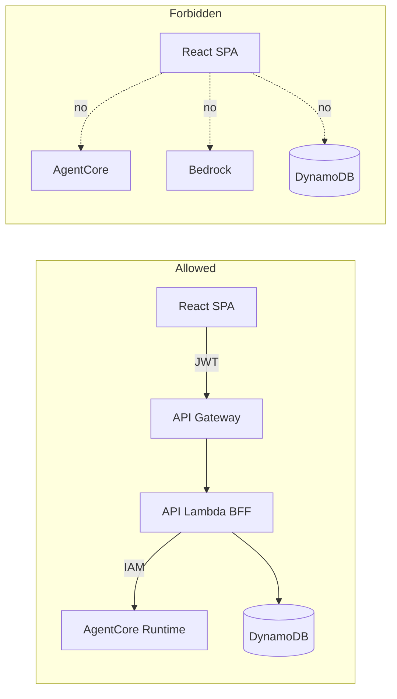
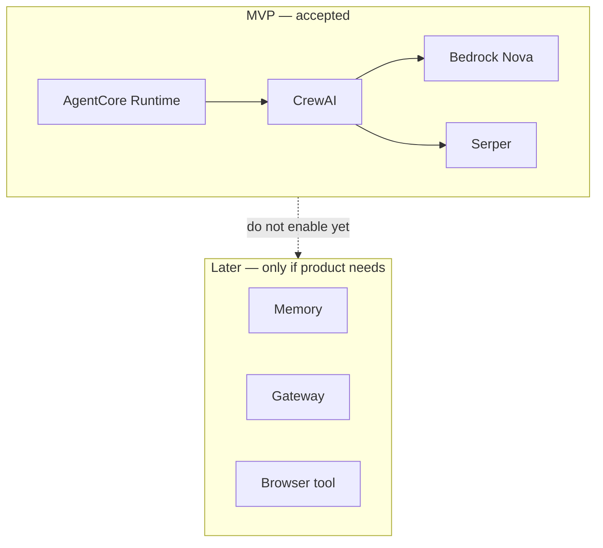

# ADR 003: BFF-only AgentCore access and Runtime-only MVP

- **Status:** Accepted
- **Date:** 2026-07-21
- **Deciders:** Project maintainers

## Context

Planning uses **CrewAI on Amazon Bedrock AgentCore**. Two easy mistakes would raise cost and risk:

1. Letting the **browser** call AgentCore (or Bedrock) directly with user-scoped credentials.
2. Turning on extra AgentCore products (**Memory**, **Gateway**, **Browser** tool, etc.) “just in case” before the product needs them.

We already chose a thin API Lambda BFF (Backend for Frontend) behind API Gateway ([002](./002-single-api-lambda.md)) and async plan-next-day ([001](./001-async-plan-next-day-polling.md)). This ADR locks the **trust and cost boundary** around AgentCore.

## Decision

### 1. Browser never calls AgentCore

Production path only:

`Browser → Cognito (JWT) → API Gateway HTTP API (JWT authorizer) → API Lambda (BFF) → AgentCore Runtime`  
(and DynamoDB only from the BFF / trusted workers — never from the browser).

- The SPA holds a **Cognito JWT**, not AWS credentials and not an AgentCore invoke URL for end users.
- Only the BFF (server-side IAM role) may `bedrock-agentcore:InvokeAgentRuntime` (or equivalent).
- AgentCore payloads are built on the server from owned trip state (user `sub` from the authorizer), not from untrusted client-supplied “run this crew as anyone.”

### 2. AgentCore Runtime-only for MVP (cost)

For MVP / portfolio deploy, enable **AgentCore Runtime** only — enough to run the CrewAI entrypoint (`load_crew` / `kickoff`).

**Do not enable for MVP:**

| Product | Why skip for now |
| --- | --- |
| **AgentCore Memory** | Session/long-term memory adds events + retrieval tokens; prefs come from the trip form / profile instead |
| **AgentCore Gateway** | Extra networking/tool surface; crews can use in-process tools (e.g. Serper) without it |
| **AgentCore Browser** (or similar hosted browser tools) | High cost/complexity; not required for day-plan JSON |

CrewAI `memory: false` on the crew side stays aligned with this (no embedder bill for cross-run “learning”). See root README cost notes.

## Consequences

### Positive

- Clear security story: JWT at the edge, IAM to AgentCore, no AWS keys in the SPA.
- Idle and feature cost stay low: pay for Runtime + Bedrock tokens (+ Serper) when planning runs.
- Matches thin Lambda packaging: CrewAI lives in the AgentCore package, not the API zip ([002](./002-single-api-lambda.md)).

### Negative / tradeoffs

- Multi-turn “revise my plan” chat without Memory needs form state or DynamoDB-held context.
- Tooling that truly needs a hosted browser must wait or use a different design.
- Local `CREW_MODE=local` / `fake` bypasses AgentCore for learning; production path must still obey this ADR.

## Alternatives considered

| Option | Why not (for MVP) |
| --- | --- |
| Cognito Identity Pool → browser invokes AgentCore | Exposes invoke path to clients; harder to enforce trip ownership and spend caps |
| AgentCore Memory on day one | Cost + prompt bloat; trip preferences already on TRIP / profile |
| AgentCore Gateway / Browser for “completeness” | Complexity and bill without an access pattern we need |
| Put CrewAI inside API Lambda | Fat package, long cold starts, couples HTTP timeout path to the crew ([001](./001-async-plan-next-day-polling.md), [002](./002-single-api-lambda.md)) |

## Improving for bigger scale

- Add **Memory** only for cross-session personalization or multi-turn revise flows, with tight retrieval limits.
- Add **Gateway / Browser** only when a concrete tool cannot run in-process or via Serper-like APIs.
- Keep the BFF as the only AgentCore caller even at scale; scale the *worker* path (SQS, reserved concurrency), not browser→AgentCore.

## Follow-ups

- [ ] Finish AgentCore invoke client in the BFF (no public AgentCore URL in frontend env)
- [ ] Terraform: Runtime + invoke IAM only; leave Memory/Gateway flags off
- [ ] Document `CREW_MODE=agentcore` as the only production planning path
