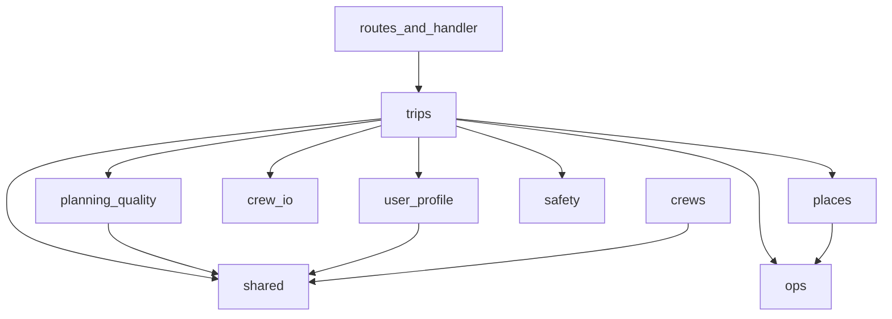

# ADR 005: Domain packages instead of a flat `services/` blob

- **Status:** Accepted (implemented)
- **Date:** 2026-07-24
- **Deciders:** Project maintainers
- **Related:** [`backend/scripts/run_migration_suite.sh`](../../backend/scripts/run_migration_suite.sh), [`backend/tests/test_services_migration_contract.py`](../../backend/tests/test_services_migration_contract.py)

## Context

`backend/src/services/` was a **flat bag of ~22 modules (~5.5k LOC)**. `trip_service.py` alone was ~1725 lines and orchestrated:

- Trip CRUD
- City route propose/confirm (+ synthetic city route)
- Async claim / Event worker / sync plan-next-day
- Crew input construction, retry, quality, enrich, persistence
- Suggest / remove place / delete day

Leaf helpers already exist (`day_balance`, `plan_day_retry`, `places_*`, …), but:

1. Splitting `TripService` into **more flat peers** would worsen discoverability.
2. Import paths (`from services.X`) do not communicate domain boundaries or allowed dependencies.
3. Related concerns (Places I/O, quality policy, trip orchestration) are co-located by accident rather than by package boundary, which makes ownership and safe refactors harder.

### Baseline check (before any move)

```bash
cd backend
./scripts/run_migration_suite.sh   # contract + domain regression
uv run pytest                      # full suite before merge
```

**Recorded baseline (2026-07-24, pre-move):** migration suite OK — **5** contract + **183** domain tests passed. Full backend suite was **282** at last push including contract tests.

Contract tests lock:

- Domain import paths (`trips.*`, `places.*`, …)
- `TripService` public method names used by routes/handler
- TripService smokes: city plan/suggest/remove, country propose/confirm/plan/delete-day, list/delete

## Decision

Reorganize domain code into **packages under `backend/src/`** (or under `services/` as a namespace package — see Option A vs B). Prefer **capability packages** with a one-way dependency graph. Keep a thin **`TripService` entrypoint** (`trips/service.py`) so `routes/trips.py` and `handler.py` stay stable during the move.

### Target packages

```text
trips/                 # product orchestration
  service.py           # TripService (thin; public API unchanged; delegates to modules below)
  crud.py
  city_route.py        # uses shared.route_windows; owns propose/confirm + synthetic route
  day_index.py         # first_missing / resolve helpers (shared by plan_day + day_edit)
  plan_day.py          # claim / async / sync / _run_plan_day_and_persist
  day_edit.py          # suggest / remove / delete_day
  prompts.py           # prefs/meals/prior-days; visited_keys_from_days (reads place_key)

planning_quality/      # deterministic post-generation policy
  place_quality.py
  day_balance.py
  quality_policy.py
  plan_day_retry.py
  dedupe.py            # place_key ensure/dedupe (not trip identity)

shared/                # tiny cross-domain leaves (no orchestration)
  energy.py            # caps / clamp / target place count (profile + quality + trips)
  route_windows.py     # max_cities_for_trip, normalize windows (crews + trips)
  dates.py             # parse/validate trip dates, day_index helpers (trips + tests)

places/                # Google Places + photo resolve/cache
  client.py
  enrich.py
  photo_cache.py
  image_fallback.py

crew_io/               # crew payload shaping (not AgentCore runners)
  context_budget.py
  envelope.py

safety/                # keyword + Bedrock guardrails
user_profile/          # ProfileService (not profile/ — avoids shadowing stdlib)
ops/                    # secrets, plan_day_worker enqueue, observability
                        # (named ops — not platform — to avoid shadowing stdlib)
```

`crews/` (runners) and `db/` (repository) stay as they are. **`crews` may import `shared` only** (today: `route_windows.max_cities_for_trip` from `fake_runner`) — never `trips`.

### Dependency rule (must hold)

```text
routes / handler
    → trips → planning_quality
            → places
            → crew_io
            → user_profile / safety / ops
            → shared
crews → shared            # not trips
places ↛ trips
planning_quality ↛ places
planning_quality ↛ trips
user_profile → shared     # not planning_quality
planning_quality → shared
trips → shared
trips → planning_quality  # e.g. plan_day → dedupe_places / place_quality
ops may be used by places/trips (secrets, metrics)
```



### Layout option (pick one in review)

| Option | Layout | Pros | Cons |
| --- | --- | --- | --- |
| **A (recommended)** | `src/trips/`, `src/places/`, … sibling to `services/` | Clear top-level domains; `services/` shrinks to shims then deleted | More top-level packages under `src/` |
| **B** | `src/services/trips/`, `src/services/places/`, … | Keeps everything under `services.` namespace | Nested packages; still says “services” for everything |

**Recommendation:** Option A. Temporary shims: `services/trip_service.py` re-exports `trips.service.TripService` until imports are updated.

### `TripService` split map

| Destination | Move from `trip_service.py` |
| --- | --- |
| `trips/crud.py` | `create_trip`, `update_trip`, `list_trips`, `get_trip`, `delete_trip`, `_require_trip`, `_load_owned_bundle`, `_split_bundle`, `_json_safe`, `_validate` |
| `trips/city_route.py` | `synthetic_city_route`, `propose_cities`, `confirm_cities`, `_route_payload`, `_sync_total_nights`, `_assert_route_fits_window`, `overnight_city_for_day` (imports `shared.route_windows`; does not own it) |
| `trips/plan_day.py` | `plan_next_day`, `start_plan_next_day`, `execute_plan_next_day`, `_plan_next_day_sync`, `_run_plan_day_and_persist`, `_persist_async_planned_day`, `_finalize_existing_planned_day`, `_day_exists`, `_cursors_from_existing_day` (day-index helpers live in `day_index.py`) |
| `trips/day_edit.py` | `suggest_place`, `remove_place`, `delete_day`, `status_after_day_edit` |
| `trips/day_index.py` | `first_missing_day_index`, `resolve_plan_day_index` (shared by plan_day + day_edit; no orchestration imports) |
| `trips/prompts.py` | `_merge_preferences`, `_meal_guidance`, `rebuild_prior_days_summary`, `visited_keys_from_days` (reads stored `place_key`; no dedupe import), `_profile_visited_keys` |
| `trips/service.py` | `TripService` class: `__init__`, `runner`/`safety`, delegates to modules above |

Do **not** pull `places_enrich` / quality / retry back into `TripService` — call existing (then packaged) modules.

### Note on `energy.py`

`profile_service` and `place_quality` (and trip plan-day) all use energy caps/helpers. Putting `energy` under `planning_quality` would force **`user_profile → planning_quality`**, which couples profile CRUD to day-plan policy.

| Choice | Shape | Verdict |
| --- | --- | --- |
| **A — shared leaf (recommended)** | `shared/energy.py` (~50 LOC constants + clamp helpers). `user_profile`, `planning_quality`, and `trips` all import it. | Keeps domains independent; matches today’s “tiny util” reality. |
| B — planning policy | Keep `energy` in `planning_quality/`; accept `user_profile → planning_quality`. | Only if we insist energy is exclusively a planning concern and are fine with that edge. |

**Decision for this ADR:** Choice A.

### Note on `route_windows.py` (and `dates.py`)

`crews/fake_runner.py` imports `max_cities_for_trip` from `route_windows` today. Putting `route_windows` under `trips/` would create **`crews → trips`**, which inverts the intended stack (runners must not depend on trip orchestration).

| Choice | Shape | Verdict |
| --- | --- | --- |
| **A — shared (recommended)** | `shared/route_windows.py` (+ `shared/dates.py`). `crews` and `trips` import shared only. | Avoids crews→trips; pure calendar/window math fits `shared/`. |
| B — trips later | Move into `trips/` only after `fake_runner` stops needing it (inline a constant or take `n_cities` from inputs). | Fine follow-up; do not do it while the import exists. |

**Decision for this ADR:** Choice A for both `route_windows` and `dates`.

### Note on `shared/` growth

Allowed leaves today: **`energy`**, **`route_windows`**, **`dates`** — all pure helpers, no DynamoDB/crew orchestration. Do not add orchestration or I/O here. If a fourth candidate appears, re-evaluate whether it belongs in a real domain package instead.

### Note on `dedupe.py`

**Decision:** `planning_quality/dedupe.py`. It is already used by `place_quality`, `plan_day_retry`, and `trips/plan_day` as place-key ensure/dedupe — not trip identity. Trip-side `visited_keys_from_days` stays in `trips/prompts.py` and only collects already-stored `place_key` values (no duplicate key-normalize logic). Do not move key ensure/dedupe under `trips/`.

## Migration phases (safe order)

Each phase ends with **green** `./scripts/run_migration_suite.sh`. Prefer small PRs / commits per phase. No behavior changes — move + re-export only.

| Phase | Work | Risk |
| --- | --- | --- |
| **0** | Baseline green (this ADR + fixed suite script) | — |
| **1** | Create `places/` package; move client/enrich/photo_*; `services/places_*.py` become re-exports | Low |
| **2** | Create `planning_quality/` (incl. `dedupe`) + `shared/{energy,route_windows,dates}.py`; shims for legacy `services.*` | Low–med |
| **3** | Create `crew_io/`, `safety/`, `user_profile/`, `ops/`; point `crews/fake_runner` at `shared.route_windows` (via shim OK until phase 6). Package is `user_profile` (not `profile`) to avoid shadowing stdlib. | Low |
| **4** | Create `trips/` + **plan_day** extract first behind `trips/service.py`. **Enforce watch-outs below** (no circular imports). | Med |
| **5** | Extract crud / city_route / day_edit / prompts into `trips/` | Med |
| **6** | Update all call sites (`routes`, `handler`, `crews`, tests) to new paths; **delete every `services.*` shim in the same PR/sprint** | Med |
| **7** | Remove empty `services/` (optional one-line pointer in backend README). **Bar: no dual import paths after this sprint.** | Low |

### Watch-outs during the `trips/` split

Circular imports are the main failure mode. Enforce in the **first plan-day extract PR (phase 4)**:

1. **Submodules never import `TripService`.** `plan_day`, `crud`, `city_route`, `day_edit`, `prompts` take `table` / `runner` / `safety` (and any other deps) as **function or constructor args** from `trips/service.py`. Only `service.py` may construct/own `TripService`.
2. **No `from trips.service import TripService` (or relative equivalent) inside other `trips/*` modules.** Reject the PR if that appears.
3. **Private helpers used by tests** — e.g. `_assert_route_fits_window` imported by `test_route_windows.py` — **promote to a public name or re-export from `shared.route_windows` / `trips.city_route` in the same phase** that moves them. Do not leave tests reaching into private `_` symbols across packages.
4. Prefer a short comment in `trips/plan_day.py` / `trips/service.py` pointing at this ADR section so the rule stays visible.

### Shim pattern (phases 1–5 only)

Prefer **explicit re-exports** so the public surface stays reviewable (no `import *`):

```python
# services/place_photo_cache.py  (temporary — delete in phase 6)
"""Deprecated shim — import from places.photo_cache instead."""
from places.photo_cache import (  # noqa: F401 — re-export surface
    clear_cache_for_tests,
    get_cached_payload,
    is_stable_photo_url,
    persist_place_photo_fields,
    # …list every name callers need
)
```

Contract test import paths were updated from `LEGACY_IMPORT_PATHS` to `DOMAIN_IMPORT_PATHS` when shims were deleted.

**Do not let shims linger past phase 6.** Dual `services.*` + domain imports become permanent debt. Treat “delete `services/` this sprint” as a hard bar once phase 6 starts — same PR or immediately following PR in the same sprint, not a later backlog item.

### Explicit non-goals

- No new “use case / repository” framework
- No FastAPI rewrite
- No DynamoDB schema changes
- No combining Places HTTP client into trip planning
- No changing OpenAPI or HTTP routes in this migration

## Consequences

**Positive**

- Domains are obvious from paths (`places/`, `planning_quality/`, `trips/`)
- `TripService` stays a thin entrypoint; plan-day logic is reviewable in isolation
- Dependency direction is enforceable in review (and later optionally with import-linter)

**Negative / cost**

- Temporary dual import paths (shims) until phase 6 — **must be deleted that sprint**
- More directories under `src/`
- Each phase must pass the migration suite

**Risks**

- Circular imports when splitting `trip_service` — mitigated by watch-outs; fail the phase-4 PR if submodules import `TripService`
- Test breakage on private helpers — mitigate by promote/re-export in the same phase
- Shim rot — mitigate with phase-6/7 hard delete bar

## Review checklist

- [x] Package boundaries match product language (trips / quality / places / …)
- [x] Dependency rule forbids `places → trips`, `planning_quality → trips`, and **`crews → trips`**
- [x] `energy`, `route_windows`, `dates` live in `shared/`; `user_profile` does not import `planning_quality`
- [x] `dedupe` lives in `planning_quality/`; `trips/plan_day` calls it; `visited_keys_from_days` only reads stored keys (no duplicate ensure/dedupe)
- [x] `TripService` public methods unchanged (see `TRIP_SERVICE_PUBLIC_METHODS` in contract test)
- [x] Phase-4 PR: trip submodules take deps as args; **never import `TripService`**
- [x] Private test helpers promoted/re-exported in the same phase they move
- [x] Shims use **explicit** re-exports (not `import *`) — deleted in phase 6
- [x] Phase 6–7: all `services.*` shims deleted same sprint; no lingering dual paths
- [x] Phases are move-only with shims; no drive-by behavior edits
- [x] Migration suite includes contract **and** domain files (not `-m migration` alone on domain files)
- [x] Option A vs B chosen and consistent with hatch/`pythonpath`
- [x] Hatch build packages list updated when new top-level packages are added (`pyproject.toml` / wheel packages) — still `packages = ["src"]`
- [x] `shared/` stays limited to pure helpers (`energy`, `route_windows`, `dates` unless a clear peer leaf appears)

## Hatch / packaging note

Today hatch builds `packages = ["src"]` with `pythonpath = ["src"]` for tests. New top-level packages (`trips`, `places`, …) live under `src/` and are importable the same way as `services` today. Confirm `build_lambda.sh` copies the whole `src/` tree (it should already).

## Status of execution

| Item | State |
| --- | --- |
| Migration contract tests + suite script | Done |
| This ADR | **Accepted** (Option A) |
| Phase 1 `places/` | Done |
| Phase 2 `planning_quality/` + `shared/` | Done |
| Phase 3 `crew_io/` / `safety/` / `user_profile/` / `ops/` | Done (`ops` not `platform`; `user_profile` not `profile` — stdlib clash) |
| Phases 4–5 `trips/` split | Done (`service.py` ~177 LOC; submodules never import `TripService`) |
| Phases 6–7 retarget + delete `services/` | Done — no dual import paths |
