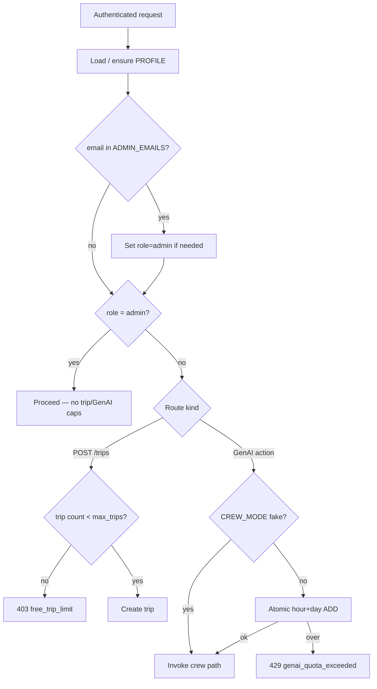
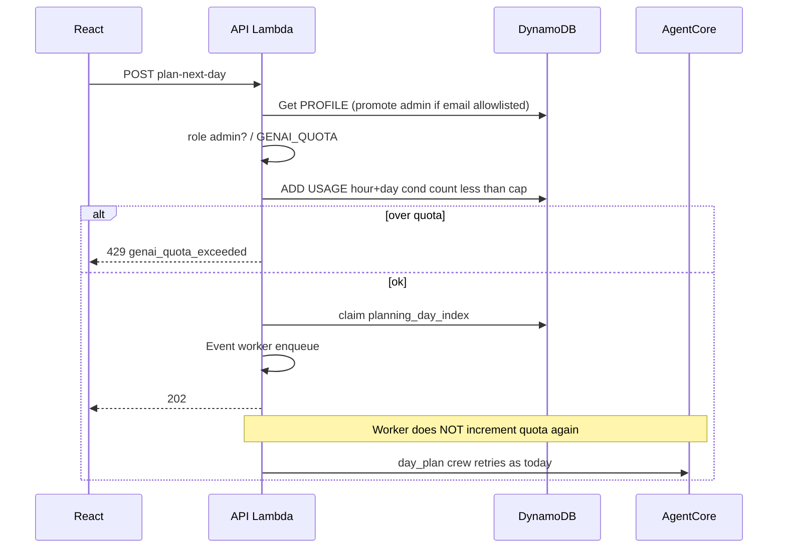

# ADR 006: Admin role on PROFILE, free-trip limit, and GenAI request caps

- **Status:** Accepted (MVP) — paid plans deferred
- **Date:** 2026-07-25
- **Deciders:** Project maintainers

## Context

AgentCore + Bedrock (and Serper/Amap) cost scales with how often users invoke crews.
The product is currently free for signed-in Cognito users with **no** per-user
spend controls. Admin metrics already need a privileged identity
(`METRICS_ADMIN_SUBS` by Cognito `sub` only), which is awkward to operate
(opaque UUIDs) and does not express “this person may also bypass cost caps.”

We do **not** want a separate user-management DynamoDB table. Cognito remains
identity only; commercial/role state belongs with the existing
`USER#{sub}` / `PROFILE` item.

Product rules for MVP (numeric limits and admin emails are **config**, not
code constants — see env / Terraform / `docs/ENVIRONMENT.md`):

| Rule | Non-admin (`role=user`) | Admin (`role=admin`) |
| --- | --- | --- |
| Trips | Cap from PROFILE `plan` via `limits.max_trips_for_user` | Unlimited |
| GenAI actions | Hour + day caps from env (later: per `plan`) | Unlimited (bypass) |
| Later | Raise limits when PROFILE `plan` changes (paid) | Unchanged |

GenAI surfaces today: `propose-cities`, `plan-next-day` (async + up to 3 crew
retries), `suggest-place`. Plan-next-day must not double-count HTTP claim + worker.

## Decision

### 1. User type lives on PROFILE (same table)

No separate users table. Extend the existing PROFILE item:

```text
pk = USER#{cognito_sub}
sk = PROFILE
```

| Field | Type | MVP | Notes |
| --- | --- | --- | --- |
| `role` | `admin` \| `user` | yes | Source of truth for admin bypass |
| `plan` | `free` \| … | yes (default `free`) | Paid tiers later; drives trip/GenAI limits |
| prefs / energy / interests / … | existing | yes | Unchanged traveler defaults |

**Cognito** = login (`sub`, email). **PROFILE** = who they are in the product
(`role`, `plan`). **`limits/`** reads PROFILE + env to enforce.

Clients must **not** be allowed to set `role` / `plan` via `PUT /profile`
(server-owned fields; strip on write).

### 2. Admin: PROFILE `role=admin`

1. **Authoritative check:** `profile.role == "admin"` (loaded by `sub`).
2. **Bootstrap:** env **`ADMIN_EMAILS`** (comma-separated). On authenticated
   traffic that loads/ensures PROFILE, if JWT email is in that list and `role`
   is not already `admin`, set `role=admin` (idempotent promote).
3. Optional break-glass: keep **`METRICS_ADMIN_SUBS`** for local/dev or IdPs
   that omit email — treat matching `sub` as admin even before PROFILE promote
   (or force promote by sub). Prefer PROFILE after first promote.
4. Shared **`is_admin(...)`** used for:
   - `GET /admin/metrics/*`
   - free-trip limit bypass
   - GenAI cap bypass
5. Trip keys stay **`USER#{sub}`** — never partition by email.

### 3. Free-trip / plan trip limit

1. On **`POST /trips`**, if `not is_admin` and the user’s trip count is already
   at or above `max_trips_for_user(profile)`, reject with **`403`** / code
   **`free_trip_limit`** (name kept for MVP free tier; may generalize later).
2. Count via existing list/query of `TRIP#` items (no separate counter for MVP).
3. Deleting a trip frees a slot under the same cap.
4. **`limits.max_trips_for_user(profile)`** maps `plan` (+ optional env overrides)
   to an integer; admin → unlimited. Do not bake plan→cap numbers into routes.
5. Do **not** implement payment / Stripe / plan SKUs in this ADR.

### 4. GenAI request caps (per logged-in user)

1. Caps are **per Cognito `sub`** (same identity as trip ownership).
2. Configure via env (and later PROFILE `plan`); do not hardcode limits in
   application modules beyond reading config:

   | Env | Meaning |
   | --- | --- |
   | `GENAI_CAP_HOUR` | Max GenAI **actions** per UTC hour |
   | `GENAI_CAP_DAY` | Max GenAI **actions** per UTC day |
   | `GENAI_QUOTA` | Kill switch (`off` disables checks) |

   Concrete default values live in Terraform / `docs/ENVIRONMENT.md`, not this ADR.

3. **No hard lifetime GenAI cap** in MVP.
4. **One action** = one logical user GenAI feature attempt that is about to
   invoke a crew (not merely a Guardrails-only preference check):
   - `POST /trips/{id}/propose-cities`
   - `POST /trips/{id}/plan-next-day` — count **once** (see timing below),
     **not** in the Event worker, **not** per quality retry
   - `POST /trips/{id}/days/{n}/suggest-place`
5. **Charge timing (MVP product rule):**
   - **Sync paths** (`propose-cities`, `suggest-place`, sync `plan-next-day`):
     run cheap pre-crew gates first (status / day_full / safety text). **Do not
     increment** if safety rejects — those attempts never reach a crew.
   - **Async `plan-next-day`:** increment after a successful planning **claim**
     and before enqueue (fail-closed before AgentCore). Worker-side safety /
     crew failure still counts — the action was already committed to the queue.
   - **Do not count:** `CREW_MODE=fake`, Places enrich, standalone
     Guardrails-only pref checks, photo proxy, CRUD, metrics reads.
6. **Admin** (`role=admin`) skips check and increment.
7. Persist counters on the **same** trip DynamoDB table:

   | Key | Value |
   | --- | --- |
   | `pk` | `USER#{sub}` |
   | `sk` | `USAGE#GENAI#HOUR#YYYYMMDDHH` or `USAGE#GENAI#DAY#YYYYMMDD` (UTC) |
   | attrs | `count` (Number), `expires_at` (TTL on hour/day buckets) |

   **TTL cleanup (so bucket items do not accumulate forever):** the trip table
   already enables DynamoDB TTL on attribute **`expires_at`**. Each GenAI usage
   item sets `expires_at` to a Unix epoch **in seconds** shortly after the
   bucket ends (e.g. hour bucket + a small grace window). DynamoDB then deletes
   expired items in the background at no write-cost to us. Caps (`GENAI_CAP_*`)
   are separate: they reject over-limit `ADD`s; TTL only removes stale keys.

   AWS docs (plain URLs):

   - https://docs.aws.amazon.com/amazondynamodb/latest/developerguide/TTL.html
   - https://docs.aws.amazon.com/amazondynamodb/latest/developerguide/time-to-live-ttl-before-you-start.html
   - https://docs.aws.amazon.com/amazondynamodb/latest/developerguide/time-to-live-ttl-how-to.html

   Note: deletion is eventually consistent (often within ~48 hours of expiry).
   Expired items may still appear in reads until purged; for usage counters we
   only ever `ADD` the **current** hour/day `sk`, so stale buckets are harmless.

8. Enforce with atomic `UpdateItem` `ADD count :1` and condition
   `attribute_not_exists(count) OR count < :cap`. On failure → **`429`** /
   code **`genai_quota_exceeded`** (include which window: `hour` | `day`).
   Hour then day: if the day write fails for any reason, compensate the hour
   `ADD` (best-effort) so windows stay paired.
9. Hook after pre-crew rejection gates on sync paths; on async plan-next-day,
   hook after claim / before enqueue (fail closed before AgentCore spend).

### 5. Package / code shape

Align with [005](./005-services-domain-packages.md). Package name **`limits`**:

```text
backend/src/
  auth.py                 # get_user_email; claims helpers
  limits/                 # NEW — trip/GenAI caps from PROFILE + env
    __init__.py
    admin.py              # is_admin from profile.role (+ bootstrap emails/subs)
    trips.py              # max_trips_for_user(profile) / assert_can_create_trip
    genai.py              # consume_or_raise; env/plan caps; fake-mode skip
  user_profile/           # ensure role/plan defaults; strip role/plan on PUT
  db/
    keys.py               # usage_hour_sk / usage_day_sk
    repository/usage.py   # atomic increment helpers (optional)
  routes/admin_metrics.py # require admin via profile.role
  trips/crud.py           # create_trip → limits.trips
  trips/city_route.py     # consume GenAI action
  trips/plan_day_jobs.py            # consume on async claim (start)
  trips/plan_day_agent_pipeline.py  # consume on sync plan-next-day (not worker re-entry)
  trips/suggest_place.py            # suggest_place consume (sync + async start)
  trips/city_suggest.py             # suggest_city consume
```

Frontend: map `free_trip_limit` / `genai_quota_exceeded` to clear copy; optional
read-only `role` / `plan` on GET profile for UI. `/metrics` remains API-gated.

Terraform: `admin_emails` → `ADMIN_EMAILS` (bootstrap);
`genai_cap_hour` / `genai_cap_day` (and free-plan trip cap if exposed) → Lambda env;
document values only in `docs/ENVIRONMENT.md` / tfvars examples.

### Flow





## Consequences

### Positive

- One identity model: PROFILE holds `role` + `plan`; no second users table.
- Cost exposure bounded per user without a billing system.
- Admin is durable on PROFILE after bootstrap; emails/caps stay in config.
- `limits/` maps `plan` + env → numbers so routes stay free of magic constants.
- Async plan-next-day: one quota unit per user “Plan next day.”

### Negative / tradeoffs

- Quality retries (up to 3 AgentCore invokes) still cost tokens after one
  quota unit — accepted for UX.
- Bootstrap still needs JWT email (or `METRICS_ADMIN_SUBS` break-glass).
- Must strip `role` / `plan` from client `PUT /profile` or users could self-promote.

### Out of scope (explicit)

- Payment providers, webhooks, plan SKUs, invoices
- Separate DynamoDB user-management table
- Hard lifetime GenAI cap
- Rate-limiting Places / Guardrails / photo traffic
- Changing production crew from 3-agent `day_plan`

## Alternatives considered

| Option | Why not (MVP) |
| --- | --- |
| Separate users / accounts table | Extra table + IAM; PROFILE already per-`sub` |
| Admin via env emails only (forever) | One-off; PROFILE `role` is the durable model |
| Hardcoded emails / caps in application code | Opaque; use env + PROFILE `plan` instead |
| API Gateway usage plans / API keys | Not per Cognito `sub`; can’t express trip limits |
| Count every AgentCore invoke including retries | Punishes recovery retries |
| Count on worker + HTTP | Double-counts async plan-next-day |
| Package name `entitlements` | Jargon; prefer plain **`limits`** |

## Follow-ups

- [x] Implement PROFILE `role` / `plan` + admin bootstrap from `ADMIN_EMAILS`
- [x] Implement `limits/` + wire routes + tests
- [x] Terraform / `ENVIRONMENT.md` / OpenAPI error codes (defaults live there)
- [ ] FE copy for `free_trip_limit` and `genai_quota_exceeded` (ApiError message already surfaces)
- [ ] Later: billing updates PROFILE `plan`; `limits/` maps plan → caps
