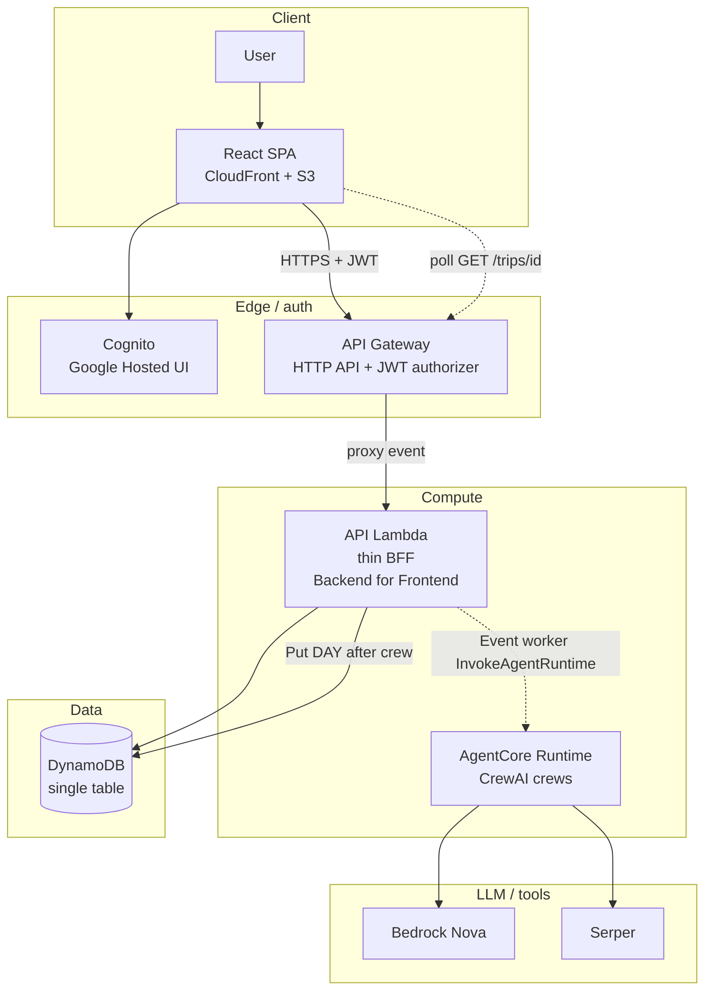
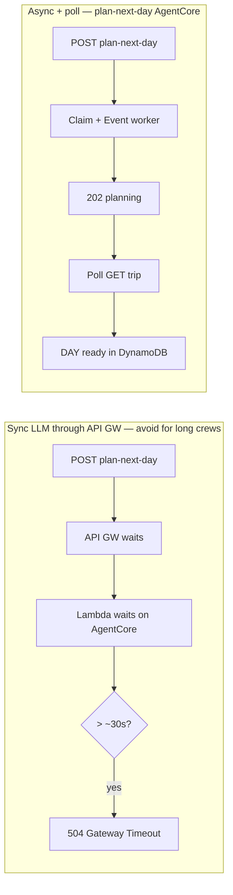
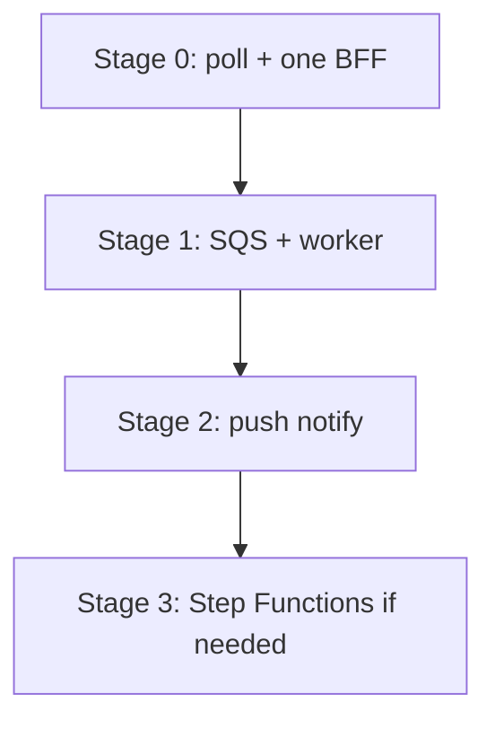

# Architecture decision records (ADRs)

Short, dated decisions about how this system is shaped — especially cost, AWS limits, and boundaries between frontend, API Lambda, DynamoDB, and AgentCore.

## Convention

- One decision per file: `NNN-short-title.md` (zero-padded number).
- Status: `Proposed` → `Accepted` → `Superseded by NNN` (or `Deprecated`).
- Keep each ADR focused: context, decision, consequences. Link code/PRs when useful.
- Do **not** put long tutorials here; put those in package READMEs.

## Index

| # | Title | Status |
| --- | --- | --- |
| [001](./001-async-plan-next-day-polling.md) | Async plan-next-day + client polling | Accepted (AgentCore: 202+poll; fake/local: sync 200) |
| [002](./002-single-api-lambda.md) | Single API Lambda behind HTTP API | Accepted |
| [003](./003-bff-agentcore-runtime-only.md) | BFF-only AgentCore + Runtime-only MVP | Accepted |
| [004](./004-crew-quality-envelope.md) | Crew quality envelope + hard vs soft relevance | Accepted |

## System context (target)

Browser never talks to AgentCore or DynamoDB. Cognito issues JWTs; API Gateway verifies them before Lambda runs.

## Sync vs async (why polling)

**Deployed (`CREW_MODE=agentcore`):** `plan-next-day` is **async** — claim + Lambda Event worker + **202**, client polls `GET /trips/{id}` until the DAY appears ([001](./001-async-plan-next-day-polling.md)). Fake/local stay sync **200** for fast tests.

**Still sync on the gateway path:** `propose-cities` (and other short routes). City-route crews that exceed ~30s can still 504 — deferred follow-up in ADR 001.

## Improving for bigger scale

Current ADRs optimize for **low idle cost** and a portfolio/demo traffic profile. When volume or UX demands more:

| Stage | Trigger | Change |
| --- | --- | --- |
| 0 (now) | Learning / demo | Polling + thin BFF (Backend for Frontend) + AgentCore |
| 1 | Noisy polls or long waits | Backoff / ETag; optional SQS + worker Lambda |
| 2 | Many concurrent “Planning…” UIs | WebSocket or AppSync push on DAY write |
| 3 | Multi-step crews, visible pipeline | Step Functions around AgentCore |
| 4 | Interactive API starved by planning | Reserved concurrency; split BFF vs worker |

Details: [001](./001-async-plan-next-day-polling.md#improving-for-bigger-scale), [002](./002-single-api-lambda.md#improving-for-bigger-scale).

