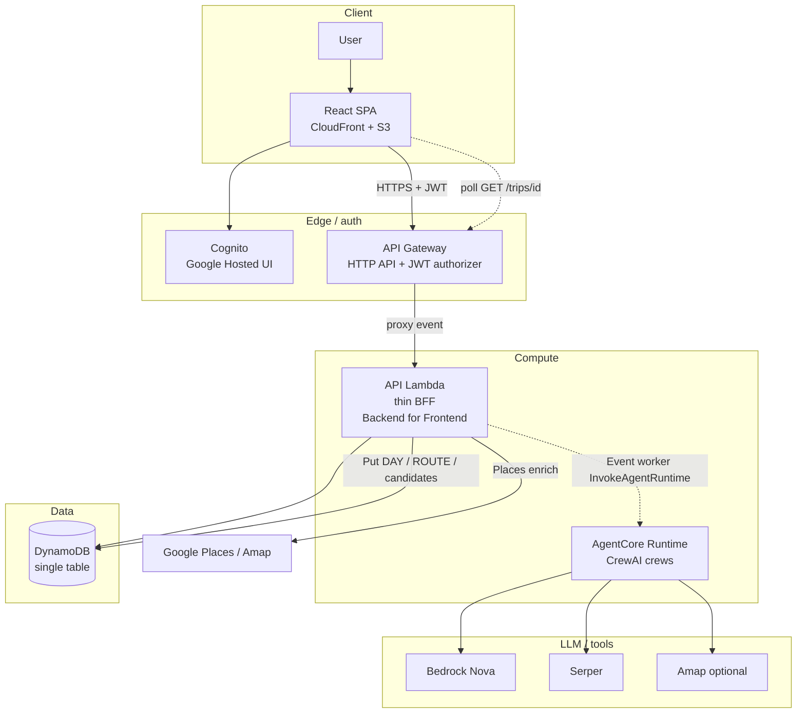
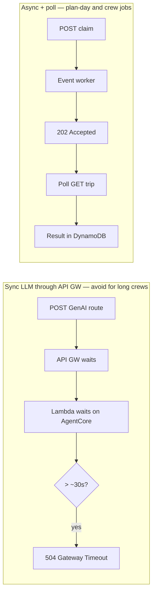
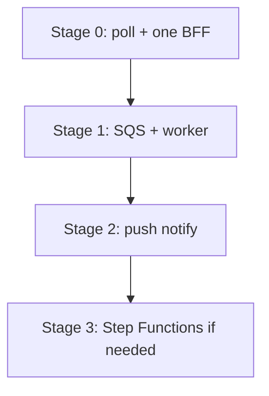

# Architecture decision records (ADRs)

Short, dated decisions about how this system is shaped — especially cost, AWS limits, and boundaries between frontend, API Lambda, DynamoDB, and AgentCore.

## Convention

- One decision per file: `NNN-short-title.md` (zero-padded number).
- Status: `Proposed` → `Accepted` → `Superseded by NNN` (or `Deprecated`).
- Keep each ADR focused: context, decision, consequences. Link code/PRs when useful.
- Do **not** put long tutorials here; put those in package READMEs.

## Index

| # | Title | Status |
| --- | --- | --- |
| [001](./001-async-plan-next-day-polling.md) | Async GenAI jobs + client polling | Accepted (plan-day + propose/suggest crew jobs; tests may force sync 200) |
| [002](./002-single-api-lambda.md) | Single API Lambda behind HTTP API | Accepted |
| [003](./003-bff-agentcore-runtime-only.md) | BFF-only AgentCore + Runtime-only MVP | Accepted |
| [004](./004-crew-quality-envelope.md) | Crew quality envelope + hard vs soft relevance | Accepted |
| [005](./005-services-domain-packages.md) | Domain packages instead of flat `services/` | Accepted |
| [006](./006-admin-limits-genai-caps.md) | PROFILE role/plan, trip + GenAI caps via limits/ | Accepted (MVP; paid plans deferred) |
| [007](./007-ai-input-output-safety.md) | BFF INPUT/OUTPUT safety + tool scrub | Accepted (OUTPUT observe→enforce soak) |

## System context (target)

Browser never talks to AgentCore or DynamoDB. Cognito issues JWTs; API Gateway verifies them before Lambda runs.

```mermaid
flowchart TB
  subgraph client [Client]
    user[User]
    spa[React SPA<br/>CloudFront + S3]
  end

  subgraph edge [Edge / auth]
    cognito[Cognito<br/>Google Hosted UI]
    apigw[API Gateway<br/>HTTP API + JWT authorizer]
  end

  subgraph compute [Compute]
    lambda[API Lambda<br/>thin BFF<br/>Backend for Frontend]
    agentcore[AgentCore Runtime<br/>CrewAI crews]
  end

  subgraph data [Data]
    ddb[(DynamoDB<br/>single table)]
  end

  subgraph llm [LLM / tools]
    bedrock[Bedrock Nova]
    serper[Serper]
    amap[Amap optional]
  end

  user --> spa
  spa --> cognito
  spa -->|"HTTPS + JWT"| apigw
  apigw -->|"proxy event"| lambda
  lambda --> ddb
  lambda -.->|"Event worker InvokeAgentRuntime"| agentcore
  agentcore --> bedrock
  agentcore --> serper
  agentcore --> amap
  lambda -->|"Places enrich"| placesApi[Google Places / Amap]
  lambda -->|"Put DAY / ROUTE / candidates"| ddb
  spa -.->|"poll GET /trips/id"| apigw
```

## Sync vs async (why polling)

**Long LLM routes** use **async** claim + Lambda Event worker + **202**, then the client polls `GET /trips/{id}` ([001](./001-async-plan-next-day-polling.md)):

| Route | Default async gate |
| --- | --- |
| `plan-next-day` | `CREW_MODE=agentcore` (`PLAN_NEXT_DAY_ASYNC=auto`) |
| `propose-cities`, `suggest-city`, `suggest-place` | `CREW_LLM_ASYNC` default **on** |

Fake/local tests often force sync **200** (`CREW_LLM_ASYNC=off`; plan-day stays sync unless `PLAN_NEXT_DAY_ASYNC=on`).

```mermaid
flowchart LR
  subgraph bad [Sync LLM through API GW — avoid for long crews]
    b1[POST GenAI route] --> b2[API GW waits]
    b2 --> b3[Lambda waits on AgentCore]
    b3 --> b4{"> ~30s?"}
    b4 -->|yes| b5[504 Gateway Timeout]
  end

  subgraph good [Async + poll — plan-day and crew jobs]
    g1[POST claim] --> g2[Event worker]
    g2 --> g3[202 Accepted]
    g3 --> g4[Poll GET trip]
    g4 --> g5[Result in DynamoDB]
  end
```

## Improving for bigger scale

Current ADRs optimize for **low idle cost** and a portfolio/demo traffic profile. When volume or UX demands more:

| Stage | Trigger | Change |
| --- | --- | --- |
| 0 (now) | Learning / demo | Polling + thin BFF (Backend for Frontend) + AgentCore |
| 1 | Noisy polls or long waits | Backoff / ETag; optional SQS + worker Lambda |
| 2 | Many concurrent “Planning…” UIs | WebSocket or AppSync push on DAY write |
| 3 | Multi-step crews, visible pipeline | Step Functions around AgentCore |
| 4 | Interactive API starved by planning | Reserved concurrency; split BFF vs worker |

Details: [001](./001-async-plan-next-day-polling.md#improving-for-bigger-scale), [002](./002-single-api-lambda.md#improving-for-bigger-scale).

```mermaid
flowchart TB
  s0[Stage 0: poll + one BFF] --> s1[Stage 1: SQS + worker]
  s1 --> s2[Stage 2: push notify]
  s2 --> s3[Stage 3: Step Functions if needed]
```
